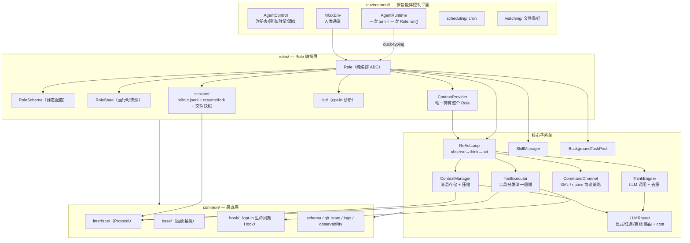
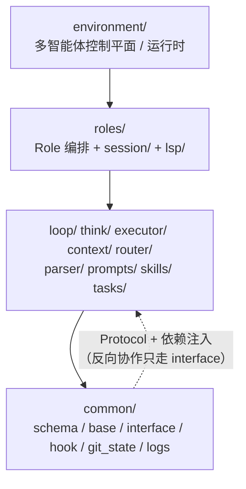
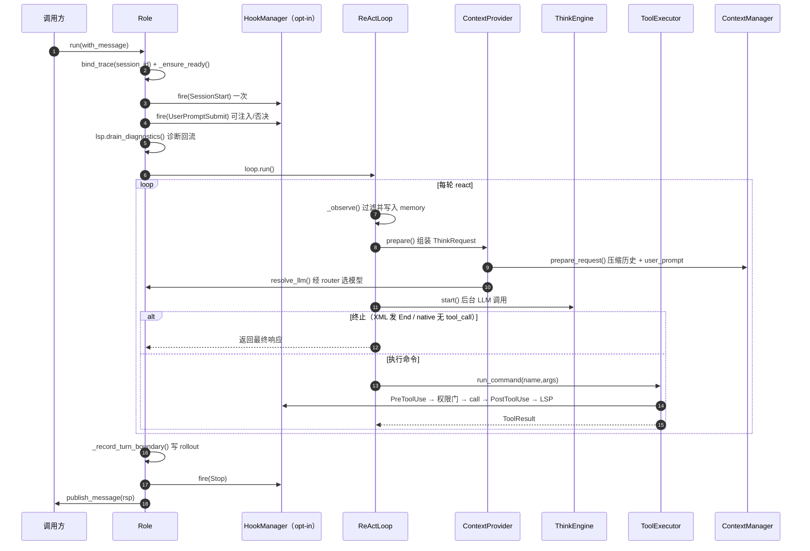

# AgentFrame — 架构文档

> 本文基于对 `metagpt/` 源码的逐文件阅读整理，描述这个重构后的 Agent 框架
> （内部代号 *AgentFrame*，包名仍为 `metagpt.*`）的整体架构、分层约束、核心执行
> 路径与各子系统职责。代码引用使用 `文件:行号` 形式，便于跳转。

---

## 1. 设计总览

AgentFrame 把一个"会思考、会用工具、能多智能体协作"的 Agent 拆成**纯编排的
`Role`** + 一组**惰性初始化的子系统**。核心理念：

- **组合优于继承**：`Role` 不再是 Pydantic 模型，而是一个普通 ABC
  （`roles/role.py:72`）。它只做编排，所有能力委托给子系统组件。
- **静态配置 / 运行时状态分离**：`RoleSchema`（部署期静态配置，Pydantic）与
  `RoleState`（运行期可序列化快照，Pydantic）严格分离
  （`roles/role_schema.py`、`roles/role_state.py`）。
- **能力注入（capability injection）**：工具拿不到 `Role`、`RoleState` 或 memory；
  只能通过 `Role.tool_capabilities()`（`roles/role.py:522`）这张**显式白名单**拿到
  少数窄方法。`getattr(role, ...)` 从不使用。
- **协议无关的 ReAct 循环**：think→act 循环（`loop/react_loop.py`）不关心
  XML 还是 native tool-use，由 `CommandChannel` 策略对象隔离。
- **opt-in 的高级层**：权限、Hook、LSP、会话持久化、文件快照等都是**默认关闭、
  按需开启**的层；未配置时调用点短路，零开销、保持旧行为。
- **严格单向分层**：底层（`common/`）永不 import 高层（`roles/`、`executor/`）。
  跨层协作通过 `common/interface/` 中的 `Protocol` + 依赖注入完成。

### 整体架构总览



---

## 2. 包分层与依赖方向

```
            ┌──────────────────────────────────────────────┐
  最高层    │  environment/   （多智能体控制平面 / 运行时）   │
            ├──────────────────────────────────────────────┤
            │  roles/         （Role 编排 + session/lsp）     │
            ├──────────────────────────────────────────────┤
            │  loop/  think/  executor/  context/  router/   │
            │  parser/  prompts/  skills/  tasks/            │
            ├──────────────────────────────────────────────┤
  最底层    │  common/        （schema / base / interface /  │
            │                  hook / git_state / logs ...）  │
            └──────────────────────────────────────────────┘
        依赖只允许从上往下；反向协作走 common/interface 的 Protocol。
```



关键分层约束（在代码注释中反复声明）：

- `context/` 可以依赖 `executor/`（向下），但反向禁止（`context/manager.py:27`）。
- `common/hook/` 在最底层，**不能** import `executor/permission`；因此
  `HookBehavior` 是重新声明的 Literal，由 executor seam 折叠成真正的
  `PermissionDecision`（见 MEMORY 中 Hook 一节、`executor/tool_executor.py:189`）。
- `environment/` 永不 import `roles.Role`——`AgentRuntime` 对 Role 做 **duck-typing**
  （`environment/runtime.py:18`）。
- `router/cost/` 只依赖 `common/`，不 import `context/`。

### `common/base/` vs `common/interface/`

- `common/base/`：**可被继承的抽象基类**（`BaseRole` / `BaseAgent` / `BaseLoop` /
  `BaseThinkEngine` / `CommandChannel` / `Singleton`），只依赖 `common`+stdlib
  （`common/base/__init__.py`）。
- `common/interface/`：**结构化 Protocol**（`HookRunner` / `SessionRecorder` /
  `FileSnapshotStore` / `LspNotifier` / `LLMClient` / `MessageStore` /
  `BackgroundPool` ...）。高层把具体实现注入到低层声明的 Protocol slot 上，
  实现解耦。

---

## 3. 核心执行路径

一次 `Role.run()` 的完整链路（`roles/role.py:720`）：

```
Role.run(with_message)
  └─ bind_trace(session_id)                     # 日志关联 trace-id
  └─ _ensure_ready()                            # 惰性建 ContextManager / skills / MCP
  └─ [hook] SessionStart (一次)
  └─ 包装 with_message → Message
       └─ [hook] UserPromptSubmit               # 可注入上下文/否决本轮
       └─ LSP drain_diagnostics()               # 上一轮编辑的诊断回流（ephemeral）
       └─ put_message(msg)                       # 进 msg_buffer
  └─ loop = _make_loop()  (ReActLoop)            # 散参注入组件
  └─ rsp = await loop.run()
  └─ finally:
       ├─ state.latest_observed_msg = ...        # 崩溃恢复用
       ├─ _record_turn_boundary()                # 写 turn_context 事件到 rollout
       └─ [hook] Stop
  └─ publish_message(rsp)
```



### ReActLoop（`loop/react_loop.py`）

循环自身拥有 **observe 步**（从 msg_buffer 取消息、按 watch/addresses 过滤、写入
memory store）和迭代状态（consecutive 计数）。每轮：

1. `_observe()`：拉取并过滤新消息 →`add_batch` 到 ContextManager。
2. `_step_think()`：经 `ContextProvider.prepare()` 组装 ThinkRequest →
   `ContextProvider.resolve_llm()` 经 router 选模型 → `ThinkEngine.start()`
   后台 LLM 调用。`active` 信号关闭时立即返回 False（工具可触发 kill switch）。
3. 终止判定 `channel.is_terminal()`：XML 协议靠模型发 `End` 命令（调
   `deactivate()`）；native 协议靠模型停止调工具、返回纯文本。
4. `_step_act()`：`channel.iter_commands()` 解析命令 → 逐个
   `executor.run_command()`；首个失败后剩余命令记 `[SKIPPED]`（native 协议
   要求每个 tool_call 必须有配对 tool_result）。
5. post-check：达到 `max_react_loop` / `max_consecutive_react_limit` 时，若有
   `ask_human` 工具则询问人类是否继续，否则 break。

**think 与 act 的对称**：`ThinkEngine`（`think/think_engine.py`）封装 LLM 调用、
流式、去重检测；`ToolExecutor` 封装工具分发。Role 只编排两者。

### CommandChannel（协议策略，`parser/`）

`make_command_channel(protocol, provider)` 产出 `XmlCommandChannel` 或
`NativeToolChannel`。默认 `command_protocol="native"`（`role_schema.py:53`）。
native 信封（OpenAI vs Anthropic）由 `infer_native_tool_provider(config.llm)`
从 LLM 配置推断，而非写死在 schema——因为它必须匹配实际发请求的 client。

---

## 4. Role 的组成（惰性子系统）

`Role` 持有一组 `Optional` slot，全部通过 `@property` 惰性构建并缓存
（`roles/role.py:208-415`）：

| 子系统 | 类型 | 职责 |
|---|---|---|
| `router` | `LLMRouter` | 三种路由方式选 LLM（见 §6） |
| `context_manager` | `ContextManager` | 消息存储 + 压缩编排（见 §5） |
| `executor` | `ToolExecutor` | 工具分发引擎（见 §7） |
| `think_engine` | `ThinkEngine` | LLM think 调用 + 去重 |
| `command_channel` | `CommandChannel` | XML / native 协议策略 |
| `context_provider` | `ContextProvider` | 每轮组装 think 参数（唯一持有整个 Role 的对象） |
| `skill_manager` | `SkillManager` | Skills 加载 + prompt 注入 |
| `bg_pool` | `BackgroundTaskPool` | 慢命令后台执行 + 完成通知 |
| `session_recorder` | `SessionRecorder` | 追加式 `rollout.jsonl`（见 §8） |
| `file_snapshot_recorder` | `FileSnapshotRecorder` | 文件改前快照（undo/diff） |
| `hook_manager` | `HookManager` \| None | opt-in 生命周期 Hook |
| `lsp_service` | `LspService` \| None | opt-in 语言服务器诊断 |

> `ContextProvider` 是唯一持有完整 `Role` 的对象；下游（loop）只看到窄的
> `BaseContextProvider` 接口，无法穿透 provider 触达 Role（`context_provider/provider.py:32`）。

---

## 5. 上下文管理（`context/`）

`ContextManager`（`context/manager.py:50`）一身二用：

1. **消息存储**（替代旧 `Memory`）：拥有会话历史，后端绑定
   `RoleState.context`（`LLMCallContext.messages`），所以历史可被
   checkpoint/恢复。暴露 `get/add/add_batch/delete/count/clear`。

2. **压缩编排**：`manage_history()` 跑两级 pass——
   - **microcompact**（`context/microcompact.py`）：便宜、无 LLM，原地折叠旧
     tool-result 体，返回释放的 token 数。
   - **autocompact**（`context/autocompact.py`）：贵、LLM 总结。仅当折叠后历史
     **仍**超阈值才触发；用 router 的 `compression` task 模型（默认
     claude-sonnet）做总结，重建为 `[summary] + tail` 并 swap 进 backing context，
     同时作为 replay checkpoint 写入 rollout。
   - per-call 的请求级压缩留在 `base_llm`，ContextManager 不重复。

`token_state()` 给出当前 token 预算快照（`context/token_budget.py`，CC 风格
TokenState）。`prepare_request()` 组装 think 发送的 `req = managed_history +
[user_prompt]`（user_prompt 只进请求、不进存储历史）。

---

## 6. LLM 路由与成本（`router/`）

### LLMRouter（`router/router.py:44`）

替代旧 `LLM()` 工厂，三种路由方式：

1. `route(name=/llm_config=)`：显式指定模型或 config（等价旧工厂）。
2. `route_for_task(task)`：任务映射。内置任务 `COMPRESSION_TASK` /
   `SUMMARY_TASK` 自动从 Config 上的 `compress_llm` / `summary_llm` 字段注册
   （`DEFAULT_TASK_MODELS`，`router/router.py:37`）。加新任务只需一行映射 + 一个
   Config 字段，无需代码分支。
3. `aroute(request)`：智能路由，由可插拔 `RoutingStrategy`（默认
   `RuleBasedStrategy`）从请求信号选模型。

构造时 `_auto_register_from_config()` 扫描 Config 上所有 `LLMConfig` 类型字段，
字段名即模型名，`llm` 为默认。每个实例惰性 build + 缓存，并挂上
`_fallback_supplier`——遇确定性拒绝（如内容策略）时按注册顺序故障转移到下个模型。

### Cost 子系统（`router/cost/`）

替代旧 `CostManager`。
- `usage.py` `TokenUsage`：input/cached_input/cache_creation/output/reasoning/total，
  带 OpenAI/Anthropic 适配器。
- `pricing.py`：per-Mtok 定价表 + 最长匹配查找 + 未知模型兜底（按 Sonnet 档计价）。
  `PricingMode{STANDARD,FIREWORKS,FREE}`。
- `tracker.py` `CostTracker`：per-model 用量 + 总成本 + 预算 + Codex 风格
  `context_remaining`。
- `report.py`：`/cost` 风格格式化 + status-line dict。

`base_llm._update_costs` 用 `TokenUsage.from_usage()` 捕获 cache/reasoning token
后交给 `cost_manager.add()`。

---

## 7. 工具执行（`executor/`）

### ToolExecutor（`executor/tool_executor.py:46`）

单一分发咽喉。所有工具都是 `BaseTool` 实例，从 `tool_registry` 按名解析。
每 Role 一个 executor，工具实例隔离（不同 Role 不共享实例）。

`run_command()` 的一次调用经过的关卡（按顺序）：

```
run_command(name, args)
  ├─ _get_tool(name)                        # 未声明工具对 LLM 不可见
  ├─ [hook] PreToolUse                      # 可改 args(updated_args) / deny
  ├─ PermissionEngine.check / check_multi   # opt-in 权限门（见下）
  ├─ tool.call(**args)                      # 真正执行
  │     ToolError → success=False（正常控制流）
  ├─ ToolResult.from_tool_return(raw)
  ├─ [hook] PostToolUse                     # 可追加上下文 / 标记失败
  ├─ [lsp] file_saved(path)                 # 成功的文件改动通知 LSP
  └─ _limit_result()                        # 超大结果落盘 + <persisted-output> 预览
```

### BaseTool（`executor/base_tool.py:24`）

工具契约：
- 设 `name`/`aliases`，`@register_tool` 注册，实现 `async call(**kwargs)`。
- schema 从 `call()` 签名 + docstring **自动生成**（XML 用 `get_schema`，native
  用 `get_native_schema`）。
- **能力声明** `requires`：列出需要的 Role 能力名；`bind()` 只注入这些（对照
  `tool_capabilities()` 白名单），名字不在白名单则抛 `AttributeError`。
- **权限元数据**：`risk_level`、`mutates_filesystem`、`permission_target(args)`、
  `permission_targets(args)`、`check_permissions(args)`（工具自检，可强制
  allow/deny/ask）。

### 内置工具（`executor/tools/`）

| 工具 | 说明 |
|---|---|
| `Bash` | 一次性命令，每调用新子进程，仅 cwd 持久；`requires=(get_cwd,set_cwd)` |
| `terminal` | 持久 PTY 交互终端，每 session 一个；cwd/env/venv 持久，前台程序可喂 stdin |
| `python` | 持久 Jupyter kernel；block-to-idle/timeout 自动 interrupt |
| `Read`/`Write`/`Edit` | 文件读写；Write/Edit 走 `FileMutatingTool`，改前快照 + 读前校验 |
| `notebook_edit` | `.ipynb` 文件编辑器 |
| `apply_patch` | 多路径补丁（`permission_targets` 返回多目标，合并审批） |
| `glob`/`grep` | 文件/内容搜索 |
| `Agent` | 派生子 agent（多智能体），别名 `run_agent` |
| `human` | `ask_human`/`reply_to_human` |
| `sleep` | `wait_interruptible`，活动时提前唤醒 |
| `end` | 结束 session |

> `Bash`（一次性）与 `Terminal`（持久 PTY）是两个独立工具，二者并存；
> `role.py` `_resolve_shell_tools` 只做去重，不再做映射。

### 权限系统（`executor/permission/`）

仅当 `role_schema.permissions` 设了 `PermissionConfig` 才构建 `PermissionEngine`，
否则 `None`、旧行为。两条正交轴：
- **轴 A 审批管线** `_decide()`：11 步优先级
  `deny rule > tool_check deny > ask rule > tool_check ask > bypass > allow rule >
  tool_check allow > acceptEdits+mutates > plan deny > dontAsk deny > default ask`。
  deny/ask 规则 bypass-immune。模式 `default/acceptEdits/plan/bypass/dontAsk`。
- **轴 B 沙箱** `_apply_sandbox()`：`full/read-only/workspace-write`，只收窄
  allow；越界触发 Codex 风格升级提示，"always" → `add_session_root`。

`ask` 决策经 Role 的 `request_approval` 能力 → `env.ask_human` 解析；无人类通道时
fail-closed（变 deny）。`classifier.py` 是 Codex command_safety 的移植：只读命令
自动 allow、破坏性命令强制 ask。

### MCP（`executor/mcp/`）

`init_mcp(mcps)` 初始化 MCP 服务器，把发现的工具包装成 `MCPToolAdapter`，
共享同一 `_tools` map 和分发路径。

---

## 8. 会话持久化与文件历史（`roles/session/`）

追加式 JSONL 事件日志作为**崩溃安全的真相源**（吸取 codex rollout + claude
transcript）。放在 `roles/` 因为日志要聚合 `context` 层（message/compacted）与
`roles` 层（session_meta/turn_context）的事件。

- **写侧** `SessionLog`：`{workspace}/.agent_sessions/{sid}/rollout.jsonl`。
  `create(meta)` 写首行（已存在则 no-op，resume 不重写）；`append` O_APPEND+flush。
  事件类型：`SessionMetaEvent`/`MessageEvent`/`CompactedEvent`/`TurnContextEvent`/
  `MetaUpdateEvent`/`FileSnapshotEvent`（`events.py`）。
- **恢复** `replay()`（`replay.py`）：单次正向扫描重建历史；`compacted` 事件把历史
  RESET 为检查点的 replacement_history。`Role.resume_session()` 直接灌入
  `state.context.messages[:]`（绕过 add 避免重复记录）。
- **列举** `list_sessions()`（`listing.py`）：只读 HEAD+TAIL 两窗口（不全量 parse），
  按 mtime 倒序，可按 cwd 过滤。
- **分叉** `fork()`（`fork.py`）：纯磁盘 replay 父日志→为子建新 log，记
  `parent_session_id` 血缘。`Role.fork_session()` 返回独立的兄弟 Role。
- **文件快照** `snapshot.py`：file-mutating 工具改盘前存 before-image（内容寻址
  blob）。底座可插拔：默认 `BlobStore`（sha256），代码工作区自动切
  `GitBlobStore`（独立 bare git 对象库，sha1，更省盘）。读侧 `history.py` 提供
  diff/restore/list。捕获点在 executor 层（`FileMutatingTool`），存储在 roles 层，
  经 `FileSnapshotStore` Protocol 解耦。

---

## 9. Hook 系统（`common/hook/`，opt-in）

综合 Claude Code（事件 + matcher 组 + JSON stdin/stdout + exit 码 + decision）+
Codex。事件：`PreToolUse`/`PostToolUse`/`UserPromptSubmit`/`SessionStart`/`Stop`/
`PreCompact`/`PostCompact`/`FileChanged`。

仅当 `role_schema.hooks` 或 `register_hook()` 回调存在才建 `HookManager`，否则
`Role.hook_manager` 返回 `None`，所有调用点短路。`fire(event, payload)` 选匹配
handler（in-process callback + command 子进程）全跑，`fold` 合并
（deny>ask>allow），永不抛。接入点散布在 `role.py`/`tool_executor.py`/
`context/manager.py`（见 §3、§7、§5）。

---

## 10. LSP 诊断服务（`roles/lsp/`，opt-in）

独立长驻进程 + Content-Length JSON-RPC over stdio。仅当 `role_schema.lsp.enabled`
且有 server 才启动。被动 next-turn 诊断回流：
- executor 在 PostToolUse 后对成功的 file-mutating 工具调
  `lsp_notifier.file_saved(path)`（经 `LspNotifier` Protocol）。
- 语言服务器 `publishDiagnostics` 进 `DiagnosticRegistry`（per-file
  last-write-wins）。
- `Role.run()` 下一轮在 UserPromptSubmit 后 `drain_diagnostics()`，把上一轮编辑
  产生的诊断 prepend 进消息（ephemeral）。

分层：`jsonrpc.py`（裸 wire）→`server.py`（LSP 语义/握手/didSave）→`manager.py`
（per-session 多 server）→`service.py`（concrete LspNotifier）。

---

## 11. 多智能体运行时（`environment/`）

Port 自 codex 的控制平面。**无广播循环**——消息按 `send_to` 地址路由进各 agent 的
**mailbox**（turn-atomic 投递），由 scheduler 泵。

### AgentRuntime（`environment/runtime.py:57`）

一个"活的 agent"=一个 Role + 它的 mailbox + status + wake_event。一个 "turn" 恰好
是一次 `Role.run()`。对 Role 做 duck-typing（never import Role）。状态机：
`IDLE/RUNNING/COMPLETED/ERRORED/INTERRUPTED/NOT_FOUND`。

### AgentControl（`environment/control.py:50`）

session 级控制平面，绑五个原语：
- `AgentRegistry`：总 agent 上限 + path/nickname 索引。
- `AgentExecutionLimiter`：并发 turn 上限。
- `Residency`：LRU 卸载到盘 + 重水化。
- `EventDrivenScheduler`：per-agent turn 驱动 + mailbox 排空。
- `ResidencyStore`：磁盘物化。

`send_input` / `send_inter_agent_communication`：确保容量 → 重水化被驱逐的目标 →
入 mailbox → 唤醒（trigger-turn）或不唤醒（queue-only）。完成 watcher 在子 agent
达终态时 queue-only 通知父 agent。

### AgentEnvironment / MGXEnv（`environment/base_env.py`、`environment/mgx/`）

`AgentEnvironment` 把控制平面包成旧 `BaseEnvironment` 接口
（`add_role`/`publish_message`/`roles`/`run`）。`MGXEnv` 是带**人类通道**的具体
环境——`Role.ask_human`/`reply_to_human`/`request_approval` 用 `isinstance(env,
MGXEnv)` 门控，背后是 console/human-input hook。

### 调度任务（`environment/scheduling/`）

完整对齐 cc cron：5 字段 cron 解析 + jitter + O_EXCL 单写者锁 + mtime 热重载 +
启动 missed 补偿。核心 `CronScheduler` 纯净（持 `on_fire` 回调），`CronService`
才接 `AgentControl.send_input`（解耦避环）。

### 文件监听（`environment/watching/`）

依赖无关的 mtime+size 轮询（不引 watchdog）。`FileWatcher`（core，`on_change`
回调）+ `FileWatchService`（接 HookManager，fire `FileChanged` 事件）。

---

## 12. 可观测性与日志（`common/logs/`、`common/observability/`）

- 包 `metagpt.common.logs`：`logger`（loguru）、`bind_trace(trace_id)`（contextvar
  trace-id，core patcher 给每条记录盖章）、`log_call`（函数装饰器）、
  `log_class(level=,exclude=)`（类装饰器/Mixin，自动包裹类自身的 public 方法，
  跳过 private/dunder/property/generator/已包裹/`@no_log`）。
- **风格约定**：关键类用 `@log_class` 自动日志，**不**在方法体里手写
  `logger.*`。`bind_trace` 在 `Role.run()` 接线（绑 session_id）。
- 已装饰的类：`Role`/`ReActLoop`/`ToolExecutor`/`ThinkEngine`/`ContextManager`/
  `SkillManager`/`LLMRouter`/`BackgroundTaskPool`/`AgentRuntime`（各带 `exclude=`
  排除热路径访问器）。
- Langfuse 集成：`maybe_trace`/`maybe_span`（`Role.run`/think/act/tool 处埋点）。

---

## 13. 测试布局

- 测试在 `metagpt/ztest/<subsystem>/`（**不是** `tests/`），用 pytest。
- 范围内运行：
  `python -m pytest metagpt/ztest/{roles,loop,executor,think,context,skills,router,tasks,environment} -q`
- 已知预存问题：`ztest/prompts/*` 因测试自身坏 import 路径报
  `ModuleNotFoundError: No module named 'prompts'`，与应用代码无关。

---

## 14. 一句话速记各层职责

| 层 | 一句话 |
|---|---|
| `Role` | 纯编排：observe→think→act 的指挥，不持有 LLM、不碰工具内部 |
| `ReActLoop` | think/act 循环 + observe + 迭代控制 + 协议无关终止 |
| `ThinkEngine` | 封装 LLM think 调用、流式、去重 |
| `ToolExecutor` | 工具分发单一咽喉：hook→权限→call→hook→lsp→限流 |
| `ContextManager` | 消息存储 + microcompact/autocompact 压缩 |
| `LLMRouter` | 显式 / 任务映射 / 智能 三种路由 + fallback |
| `CommandChannel` | XML vs native tool-use 协议策略 |
| `ContextProvider` | 每轮组装 think 参数；唯一持有整个 Role |
| `session/` | 追加式 rollout.jsonl 真相源 + resume/fork + 文件快照 |
| `environment/` | 多智能体控制平面：runtime/mailbox/scheduler/residency |
| `common/interface` | 跨层解耦的 Protocol；高层注入实现给低层 slot |
</content>
</invoke>
