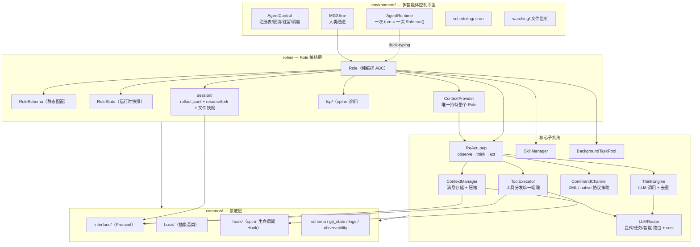
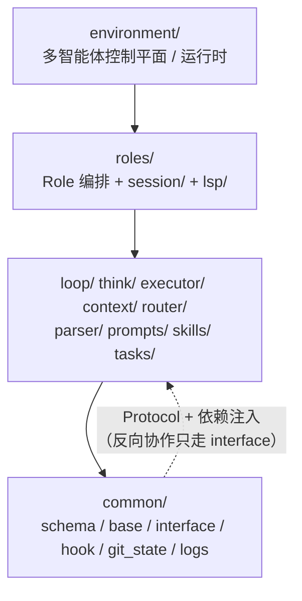
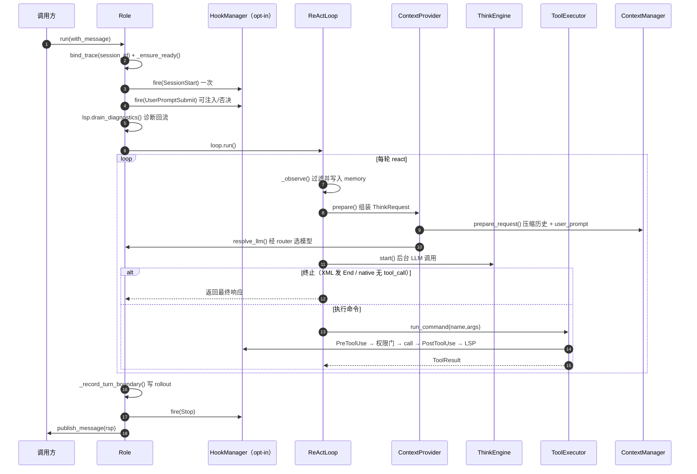

# AgentFrame

> 一个重构后的 Agent 框架（内部代号 *AgentFrame*，包名仍为 `metagpt.*`）。核心理念：
> 把"会思考、会用工具、能多智能体协作"的 Agent 拆成**纯编排的 `Role`** + 一组
> **惰性初始化的子系统**，分层单向、能力注入、高级层 opt-in。
>
> 详细设计见 [`ARCHITECTURE.md`](./ARCHITECTURE.md)（系统架构）与
> [`AGENT.md`](./AGENT.md)（Agent/Role 使用指南）。

---

## 设计要点

- **组合优于继承**：`Role` 不再是 Pydantic 模型，而是普通 ABC，只做编排，能力全部委托给子系统。
- **静态配置 / 运行时状态分离**：`RoleSchema`（部署期静态配置）与 `RoleState`（运行期可序列化快照）严格分离。
- **能力注入**：工具拿不到 `Role`/`RoleState`/memory，只能经 `Role.tool_capabilities()` 白名单拿到少数窄方法。
- **协议无关的 ReAct 循环**：think→act 循环不关心 XML 还是 native tool-use，由 `CommandChannel` 策略隔离。
- **opt-in 高级层**：权限、Hook、LSP、会话持久化、文件快照默认关闭、按需开启，未配置时短路、零开销。
- **严格单向分层**：`common/` 永不 import 高层；跨层协作走 `common/interface/` 的 `Protocol` + 依赖注入。

---

## 整体架构



### 包分层与依赖方向



> 依赖只允许从上往下；反向协作通过 `common/interface/` 的 Protocol（`HookRunner` /
> `SessionRecorder` / `FileSnapshotStore` / `LspNotifier` / `LLMClient` ...）+
> 依赖注入完成。例如 `environment/` 永不 import `roles.Role`，而是对 Role 做
> duck-typing。

---

## 一次 `Role.run()` 的执行流



---

## 快速上手

```python
from metagpt.roles.role import Role
from metagpt.roles.role_schema import RoleSchema

role = Role(
    context=my_context,                 # 注入 Context（含 config / LLM 工厂）
    name="Coder",
    role_schema=RoleSchema(
        profile="Engineer",
        goal="实现并测试功能",
        tools=["Bash", "Read", "Write", "Edit", "grep", "glob"],
        command_protocol="native",
    ),
)
rsp = await role.run("帮我修复 login 的 bug")
```

多智能体（带人类通道）：

```python
from metagpt.environment.mgx.mgx_env import MGXEnv
from metagpt.common.schema import Message

env = MGXEnv(desc="一个软件团队")
env.add_role(role_a)
env.add_role(role_b)
env.publish_message(Message(content="...", send_to={"Coder"}))
await env.run(k=1)                       # 泵一次调度
```

开启 opt-in 高级层：

```python
RoleSchema(
    tools=["Bash", "Write", "Edit"],
    permissions=PermissionConfig(mode="acceptEdits", sandbox=SandboxConfig(...)),
    hooks=HookConfig(events={...}),
    lsp=LspConfig(enabled=True, servers=[LspServerConfig(name="pyright", ...)]),
)
```

会话恢复 / 分叉：

```python
sessions = Role.list_sessions(cwd="/path/to/project")  # 列出可恢复会话
role.resume_session()                                   # 灌入历史
child = role.fork_session()                             # 分叉独立兄弟 Role
```

---

## 目录速览

| 包 | 职责 |
|---|---|
| `roles/` | `Role` 编排 + `RoleSchema`/`RoleState` + `session/`（持久化）+ `lsp/` |
| `loop/` | `ReActLoop`：observe→think→act 循环 + 协议无关终止 |
| `think/` | `ThinkEngine`：封装 LLM think 调用、流式、去重 |
| `executor/` | `ToolExecutor` 分发咽喉 + `BaseTool` + `tools/` + `permission/` + `mcp/` |
| `context/` | `ContextManager`：消息存储 + microcompact/autocompact 压缩 |
| `router/` | `LLMRouter` 三路由 + `cost/` 成本统计 |
| `parser/` | `CommandChannel`：XML vs native tool-use 协议策略 |
| `prompts/` | `PromptBuilder`：纯函数 prompt 组装（cache 友好分界） |
| `skills/` | `SkillManager` + skill 注入 |
| `tasks/` | `BackgroundTaskPool`：慢命令后台执行 + 完成通知 |
| `environment/` | 多智能体控制平面：runtime/mailbox/scheduler/residency + `scheduling/` + `watching/` |
| `common/` | `schema` / `base`（抽象基类）/ `interface`（Protocol）/ `hook` / `git_state` / `logs` |

---

## 测试

测试位于 `metagpt/ztest/<subsystem>/`（**不是** `tests/`），用 pytest：

```bash
python -m pytest metagpt/ztest/{roles,loop,executor,think,context,skills,router,tasks,environment} -q
```

</content>
