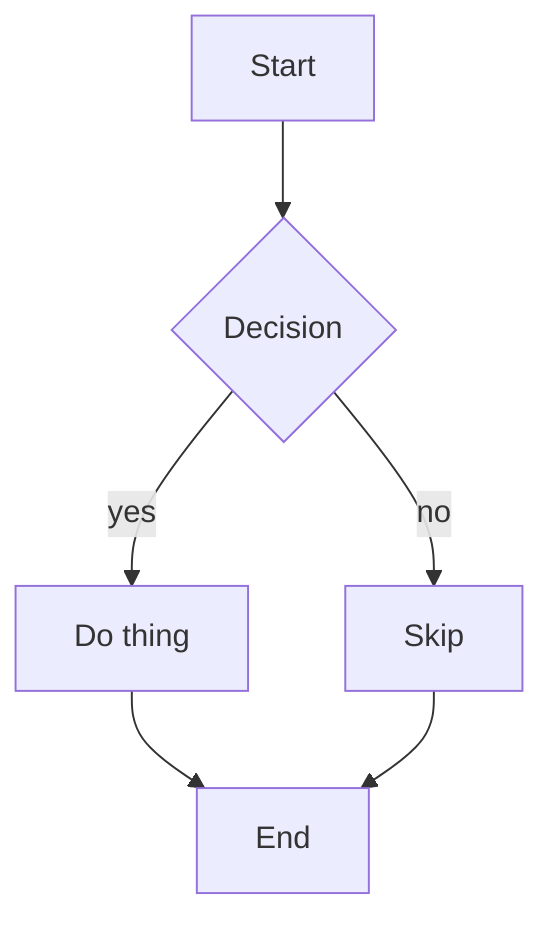
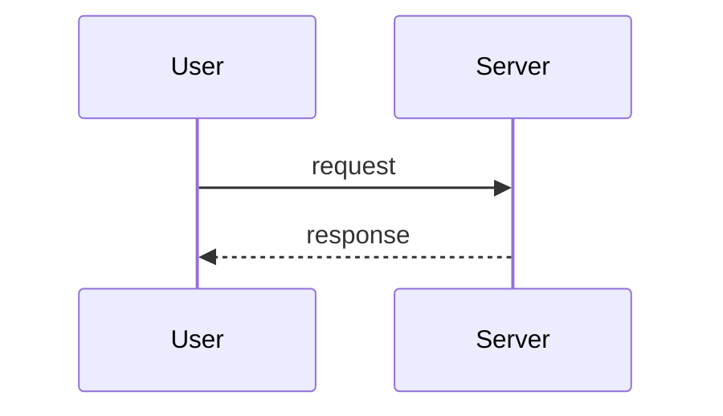
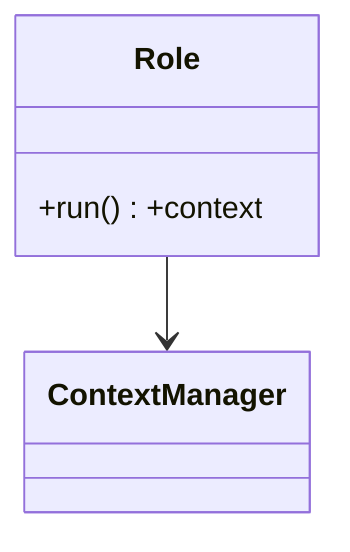

# Mermaid diagrams (via official mmdc)

Mermaid turns plain-text diagram definitions into rendered images. You author a
`.mmd` file (or fenced ```mermaid block), then render it with the official
`@mermaid-js/mermaid-cli` binary `mmdc`. No GUI, fully scriptable, deterministic
output — a natural fit for LLM-authored diagrams.

## Backend / prerequisites

Rendering uses the **official mermaid-cli** (`mmdc`), not any wrapper package.

```bash
# One-off run without installing (recommended)
npx -p @mermaid-js/mermaid-cli mmdc --version

# Or install globally
npm install -g @mermaid-js/mermaid-cli
mmdc --version
```

`mmdc` uses headless Chromium (via Puppeteer) internally; on a fresh box the
first run may download it. For offline rendering there is also the online
service `https://mermaid.ink` (encode the diagram in the URL) as a fallback.

## Core workflow

1. Write the diagram source to a `.mmd` file (use the Write tool).
2. Render it with `mmdc` (use the Bash tool for one-shot, Terminal for iterating).
3. Verify the output file exists and has non-zero size.

```bash
# Render a .mmd file to SVG
npx -p @mermaid-js/mermaid-cli mmdc -i diagram.mmd -o diagram.svg

# Render to PNG at higher scale for crisp raster output
npx -p @mermaid-js/mermaid-cli mmdc -i diagram.mmd -o diagram.png -s 3

# Render to PDF
npx -p @mermaid-js/mermaid-cli mmdc -i diagram.mmd -o diagram.pdf

# Pick a theme (default | forest | dark | neutral) and background
npx -p @mermaid-js/mermaid-cli mmdc -i diagram.mmd -o diagram.svg -t dark -b transparent
```

You can also extract and render mermaid code blocks embedded in a Markdown file
by passing the `.md` as input — `mmdc` replaces each block with an image ref.

## Diagram source examples

Flowchart:


Sequence diagram:


Class diagram:


## Common options (mmdc)

| Flag | Meaning |
|------|---------|
| `-i <file>` | Input `.mmd` or `.md` |
| `-o <file>` | Output; format inferred from extension (`.svg` / `.png` / `.pdf`) |
| `-t <theme>` | `default`, `forest`, `dark`, `neutral` |
| `-b <color>` | Background, e.g. `transparent` or `white` |
| `-s <n>` | Scale factor for PNG (higher = sharper) |
| `-w` / `-H` | Explicit width / height |
| `-c <file>` | Mermaid config JSON |

## Agent guidance

1. Prefer SVG for documentation (scales cleanly, small, diffable); PNG when a
   raster is required; PDF for print-ready output.
2. Always verify the rendered file exists and size > 0 after running `mmdc`.
3. If `mmdc` fails on the first run due to Chromium download, retry; if the
   sandbox blocks Chromium entirely, fall back to the `mermaid.ink` URL service.
4. Keep the `.mmd` source alongside the image so diagrams stay regenerable.
