# Mote 框架架构设计文档

> 本文基于对源码的逐文件通读整理，重点描述**设计思想、设计模式与模块调用流程**。
> 所有结论均可在代码中按 `文件:行号` 核对。文档随代码演进，过时处以代码为准。

---

## 目录

- [一、设计思想总览](#一设计思想总览)
- [二、分层与依赖方向](#二分层与依赖方向)
- [三、核心设计模式清单](#三核心设计模式清单)
- [四、Role：组合式编排器](#四role组合式编排器)
- [五、核心调用流程：一次 `run()` 的全景](#五核心调用流程一次-run-的全景)
- [六、Think 子流程详解](#六think-子流程详解)
- [七、Act 子流程详解](#七act-子流程详解)
- [八、CommandChannel：协议分流（XML vs Native）](#八commandchannel协议分流xml-vs-native)
- [九、Router：三种路由 + 故障恢复](#九router三种路由--故障恢复)
- [十、ContextManager：历史压缩与请求组装](#十contextmanager历史压缩与请求组装)
- [十一、Environment：多 Agent 控制平面](#十一environment多-agent-控制平面)
- [十二、EffectLedger：外部副作用幂等台账与崩溃对账](#十二effectledger外部副作用幂等台账与崩溃对账)
- [十三、扩展点速查表](#十三扩展点速查表)

---

## 一、设计思想总览

整个框架可以用四句话概括其设计哲学：

1. **组合优于继承（Composition over Inheritance）**
   `Role` 不再继承 Pydantic / 巨型基类，而是一个纯编排器，把 `ThinkEngine`、`ToolExecutor`、`ContextManager`、`CommandChannel`、`LLMRouter`、`SkillManager` 等子系统**组合**进来，且全部 **lazy-init**（`role.py:88-96`）。

2. **依赖注入 + 窄接口（DI over Narrow Seams）**
   下游组件只看到自己需要的"窄面"，从不反向持有 `Role`。例如 `ReActLoop` 只收到 `MessageStore` / `BaseThinkEngine` / `BaseContextProvider` 等接口（`react_loop.py:55-74`），工具只能拿到 `Role.tool_capabilities()` 白名单里的方法（`base_tool.py:77-96`）。

3. **协议无关的循环（Protocol-agnostic Loop）**
   "想（think）→ 做（act）"的主循环不关心底层是 XML 文本协议还是原生 tool-use，差异全部被 `CommandChannel` 策略吸收（`react_loop.py` + `parser/`）。

4. **抽象（base）与契约（interface）分离**
   `common/base/` 放需要被**继承**的抽象基类（ABC）；`common/interface/` 放用于**鸭子类型**的结构化 Protocol，且是零依赖叶子包，处处可安全 import，从根上控制循环依赖（`common/base/__init__.py`、`common/interface/__init__.py`）。

---

## 二、分层与依赖方向

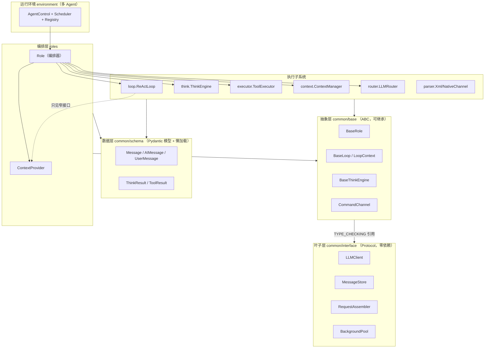

**关键规则**：依赖只能从上往下、从具体指向抽象。`common/interface` 是叶子（不 import 任何 common 子模块），`common/base` 仅在 `TYPE_CHECKING` 下引用 interface（如 `common/base/command_channel.py:11-13`），从而避免运行时循环。

---

## 三、核心设计模式清单

| 模式 | 应用位置 | 作用 |
|---|---|---|
| **Facade（门面）** | `Role`（`roles/role.py`）、`ContextManager`（`context/`） | 对外提供统一编排入口，隐藏子系统组合细节 |
| **Strategy（策略）** | `CommandChannel`（XML/Native）、`RoutingStrategy`（规则/复杂度/LLM 裁判） | 运行时切换协议/路由算法，循环与路由器保持不变 |
| **Registry + Decorator（注册表+装饰器）** | `@register_tool`（`executor/tool_registry.py`）、`@register_provider`（`router/llm/llm_provider_registry.py`） | 声明式扩展，自动发现，免改中心列表 |
| **Dependency Injection（散参注入）** | `Role._make_loop()`（`role.py:523-541`）、`ReActLoop.__init__`（`react_loop.py:55-74`） | 注入可复用组件与纯回调，绝不注入 `self` |
| **Capability Allowlist（能力白名单）** | `Role.tool_capabilities()`（`role.py:360-378`）+ `BaseTool.bind()`（`base_tool.py:77-96`） | 工具只能拿到显式发布的方法，碰不到 RoleState/memory |
| **Template Method（模板方法）** | `BaseTool.get_schema()`（`base_tool.py:123-181`） | schema 自动从 `call()` 签名+docstring 生成，子类只在动态场景覆盖 |
| **Lazy Initialization（惰性初始化）** | `Role` 全部组件属性、`get_router()`（`router.py:227-237`） | 按需构造，序列化/恢复友好 |
| **Self-registration（自注册）** | `BaseRole.__init_subclass__`（`common/base/role.py`） | 子类自动登记进注册表，支持多态反序列化 |
| **PEP 562 Lazy Module（模块级懒加载）** | `common/schema/__init__.py`、`common/exception/__init__.py` | 打破包初始化期循环依赖 |
| **RAII / Reservation** | `SpawnReservation`（`environment/registry.py`） | agent 名额"提交或回滚"语义 |
| **Observer（观察者）** | `AgentControl.start_completion_watcher`（`control.py:267-317`） | 子 agent 完成后用 weakref 通知父 agent |

---

## 四、Role：组合式编排器

`Role` 是整个框架的门面，本身几乎不含业务逻辑，只负责**装配子系统并驱动一次 `run()`**。

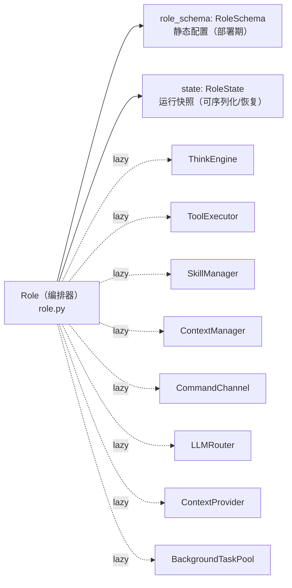

设计要点：

- **静态 vs 运行态分离**：`RoleSchema`（配置）与 `RoleState`（运行快照）分开，序列化只需 dump 这两者（`role.py:108-123`），`Role` 自身无需可序列化。
- **能力白名单是解耦关键**：工具想用 Role 的能力（如 `get_cwd`、`ask_user`、`wait_interruptible`）必须在 `tool_capabilities()` 中显式列出（`role.py:360-378`），`bind()` 只注入这些，永不 `getattr(role, ...)`。
- **`active` 信号双重身份**：`state._active` 既是循环的迭代开关，又是工具→循环的"急停开关"——`End` 工具或 `ask_user("...stop")` 调 `deactivate()` 即可中断正在运行的循环（`role.py:380-395`、`role.py:410-413`）。

---

## 五、核心调用流程：一次 `run()` 的全景

这是整个框架最重要的一张图——从 `Role.run()` 到 ReAct 循环的完整时序。

```mermaid
sequenceDiagram
    autonumber
    participant Caller as 调用方/Env
    participant Role as Role
    participant Loop as ReActLoop
    participant CP as ContextProvider
    participant CtxMgr as ContextManager
    participant Think as ThinkEngine
    participant LLM as BaseLLM
    participant Chan as CommandChannel
    participant Exec as ToolExecutor
    participant Tool as BaseTool

    Caller->>Role: run(with_message)
    Role->>Role: _ensure_ready()（物化 ctx_mgr / skill / init_mcp）
    Role->>Role: put_message(msg) 入 msg_buffer
    Role->>Loop: _make_loop()（散参注入组件）
    Role->>Loop: loop.run()

    Loop->>CP: loop_context()（取静态观察/循环控制参数）
    Loop->>Loop: _observe() 从 buffer 取信 → 过滤 → 写入 memory
    alt 无新消息
        Loop-->>Role: return None
    end
    Loop->>Loop: set_active(True)

    loop 直到预算 / 无待办 / 终止信号
        Loop->>Loop: _observe(NEXT) 二次观察（插入式消息）
        Note over Loop: ---- THINK ----
        Loop->>CP: prepare() 组装 ThinkRequest
        CP->>CtxMgr: prepare_request(user_prompt)（压缩+组装）
        Loop->>CP: resolve_llm(req)（经 Router 选模型）
        Loop->>Think: start(req, sys, tools, llm)
        Think->>LLM: aask / aask_tool
        LLM-->>Think: 文本 or tool_calls
        Think->>Think: 去重检查 → ThinkResult

        alt is_terminal（native 无 tool_calls）
            Loop->>Loop: _finish() 记录最终文本
            Loop-->>Role: return rsp（终止）
        else
            Note over Loop: ---- ACT ----
            Loop->>Chan: iter_commands(think, valid_names)
            Chan-->>Loop: 统一 IR 指令流
            loop 每条指令
                Loop->>Exec: run_command(name, args, id)
                Exec->>Tool: call(**kwargs)
                Tool-->>Exec: 原始返回
                Exec->>Exec: 归一化 ToolResult + 大输出落盘
                Exec-->>Loop: ToolResult
            end
            Loop->>Chan: record_turn(memory, rsp, executed)
            Loop->>Think: join()
            Loop->>Loop: 后置检查（max_loop / 连续次数 → 可能 ask_user）
        end
    end
    Loop-->>Role: rsp
    Role->>Role: _active=False, 标记 agent, publish_message
    Role-->>Caller: AIMessage
```

对应源码：
- 入口编排 `Role.run()` → `roles/role.py:543-576`
- 循环主体 `ReActLoop.run()` → `loop/react_loop.py:217-292`
- 观察步 `_observe()` → `loop/react_loop.py:89-121`
- think 步 `_step_think()` → `loop/react_loop.py:127-144`
- act 步 `_step_act()` → `loop/react_loop.py:146-197`

**两种终止机制（协议相关）**：
- **XML 协议**：模型发出 `End` 指令 → `deactivate()` → 下一轮 `_step_think()` 因 `is_active()` 为假而返回 `False` → 循环 break（`react_loop.py:133-134, 251`）。
- **Native 协议**：模型回复纯文本、无 tool_calls → `channel.is_terminal()` 为真 → 走 `_finish()` 直接返回（`react_loop.py:258-260`、`native_channel.py:73-74`）。

---

## 六、Think 子流程详解

`_step_think()` 把"组装请求 → 选模型 → 调用 LLM → 去重"串起来。核心组装工作委托给 `ContextProvider.prepare()`。

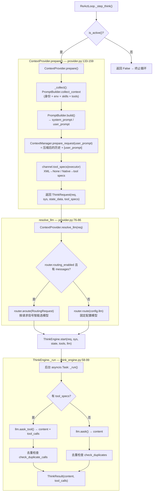

设计要点：
- **Role 不持有固定 LLM**：每一轮由循环经 router 解析出 `llm` 再传给 `ThinkEngine.start()`（`think_engine.py:34-37, 45-56`），同一 Role 可在不同请求间使用不同模型。
- **think 是后台任务**：`start()` 仅 `create_task`，真正等待发生在 act 后的 `join()`（`think_engine.py:107-112`），为 think/act 并行留出空间。
- **去重按协议分流**：XML 比对原始响应文本，Native 比对结构化调用签名，硬重复时合成一个 `ask_user` 调用兜底（`think_engine.py:80-98`）。

---

## 七、Act 子流程详解

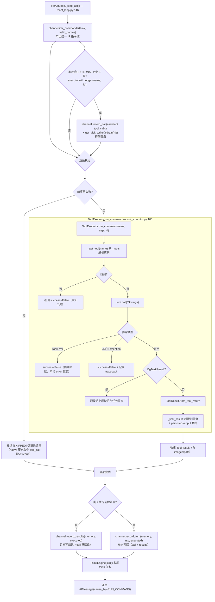

设计要点：
- **执行前持久化检查点**：本轮若含 EXTERNAL 台账工具，先 `record_call` 写入 assistant 的 tool_calls 消息并 `drain()` 落盘，**再**执行 body；否则走更省的单次 `record_turn`。这样即便副作用执行到一半崩溃，durable 历史里也已有悬空 tool_call，resume 时才能被对账愈合（见第十二节）。`record_turn` = `record_call` + `record_results` 的组合，两条路径永不漂移（`react_loop.py` / `common/base/command_channel.py`）。
- **失败快停但全记录**：首个失败后停止真正执行，但仍为剩余指令补记 `[SKIPPED]` 结果——因为 native tool-use 协议要求每个 `tool_call` 必须有配对的 `tool_result`（`react_loop.py:156-181`）。
- **工具实例隔离**：每个 `ToolExecutor` 维护自己的 `_tools` 实例缓存（`tool_executor.py:48-52`），不同 Role 间不共享工具实例，避免并发 bind 冲突。
- **大输出落盘**：超过 `max_result_size_chars` 的文本结果写盘并替换为预览，但带媒体（图片/PDF）的结果原样发给模型（`tool_executor.py:159-186`）。
- **工具搜索（Tool Search）——能力（capability）分派，三条互斥路径**：`deferred_tools` 里的外围工具默认隐藏 schema，模型经 `SearchTools` 关键词搜索后揭示。分派**按模型能力**而非 provider：`supports_native_tool_search(model)`（`common/const/llm.py`，仿 `supports_vision`/`supports_pdf_input` 的子串表）是唯一闸门——支持原生 tool search 的模型整体接管到 provider 的原生 wire，不支持的（老 Claude/老 GPT/其它兼容网关/XML）回退到共享的客户端 withhold/reveal（修掉了老模型被误盖 `defer_loading` 被 API 拒的潜伏 bug）。三路共享同一权威 `RoleState.revealed_tools`（resume-safe，不扫历史）+ 同一匹配器 `SearchTools`，仅 wire 投影不同：**(A) Anthropic native** — 语料工具全量上线标 `defer_loading:true`（以语料成员身份为准，跨揭示 `tools=` 前缀字节稳定，prompt 缓存不失效），`SearchTools` 结果经 `ToolResult.data["tool_references"]` → `ToolMessage.tool_references` → `_tool_references` 私有 wire key → `AnthropicLLM._convert_messages` 渲染成 `tool_reference` 块，缓存断点移到最后一个非 `defer_loading` 工具（规避 `defer_loading`+`cache_control` 同存的 400）；**(B) OpenAI Responses native**（gpt-5.4+）——`resolve_api_type` 把可用模型整体路由到新 provider `OpenAIResponsesLLM`（`LLMType.OPENAI_RESPONSES`，`responses.create`，仿 AnthropicLLM 的 convert-in/normalize-out），同一 `_tool_references` seam 渲染成 `tool_search_call`+`tool_search_output` 对（`execution=client`，内嵌工具定义标 `defer_loading:true`，前缀字节稳定），响应里的 `tool_search_call` 归一回 `SearchTools` 调用走同一 executor；`to_native_tool_specs` 新增扁平 `"openai_responses"` envelope；**(C) 客户端回退**，再细分两种（不再一刀切 withhold）：**(C1) SPLIT（老模型 native 通道）** — 语料工具的**函数名 + 参数结构（input_schema）留在 `tools=`**（保留结构化/受约束调用能力 + `tools=` 前缀字节稳定 → 揭示不失效缓存），仅把**工具描述**换成常量占位 `SPLIT_TOOLSPEC_DESC`（不标 `defer_loading`）。描述走**未揭示→揭示的两段生命周期**（缓存经济学：临时尾部每轮重发完整描述 = O(揭示数×描述长) 永久未缓存开销，故揭示后改走持久化）：**未揭示**工具的一行简述放临时提醒尾部（缓存断点之后）的 `SplitToolMenuContextSource`（"# Additional tools"，`split_tool_menu()` 仅列未揭示语料工具的 `_one_line` 简述）；**揭示**时 `SearchTools` 把该工具**完整（多行）描述**（`catalog.describe_deferred(names)`）既写进结果 body（进入可缓存历史）、又经 `register_resource(kind="tool")` 注册为 sticky 资源持久化进 `common/resource` ResourceRegistry（`kind="tool"` 不在 `POST_COMPACT_MAX_ROUNDS`/`PER_KIND_BUDGET` 里 → 永久 re-project、无子上限，同 skill body 语义 → 压缩后经 `sticky_provider` 重投影存活），该工具随即从临时菜单**掉出**（菜单只增不减地缩小）——因此 `SearchTools.reconstructable=False`（否则 fold 会把承载持久描述的 body 清空）。resume 时 `session_manager._rebuild_revealed_tool_resources()` 从 `RoleState.revealed_tools`（durable 权威）× `catalog.describe_deferred()` 重新注册描述，即便崩溃前原 body 已被压缩也能重投影。老模型无法展开 `tool_reference`/`tool_search` 块，故 `record_results` 的 `tool_references` 打标按 `_server_side_tool_search` 门控**抑制**（老模型经 RoleState 揭示 + 尾部描述菜单发现），与 `native_specs` 字节对齐。**(C2) WITHHOLD（仅 XML）** — `schemas_for` 里 `_is_hidden` 直接扣掉 schema 直到揭示（XML 无 `tools=` 前缀需保护）。关键洞见：native wire **永不 withhold**（要么 server_defer 标记、要么 SPLIT 占位），withhold 在 native 上的"省"是幻觉（一次揭示即重算整个前缀）。菜单源仅在 `_effective_deferred_tools(role) and not _uses_native_tool_search(role)` 时构建（native → `SplitToolMenuContextSource`；XML → `DeferredToolIndexContextSource`；A/B 能力路抑制——API 自带索引已见全量 deferred 定义）。
- **工具搜索全局开关（`toolsearch.enable`）**：`ToolsConfig.toolsearch: ToolSearchConfig{enabled: bool=True}`（`common/schema/tool_config.py`）。唯一真相源 helper `_effective_deferred_tools(role)`（`roles/role_components.py`）= `enabled` 时返回 `role_schema.deferred_tools`、否则 `[]`——所有延迟决策（executor 的 `deferred=` 集、菜单门控、`_uses_native_tool_search`）都读它。`enabled=False` → 延迟集清空 → `SearchTools` 不绑定（绑定以非空延迟集为条件）→ 零开销、完全走普通全量 toolset。
- **工具绑定（创建期）**：

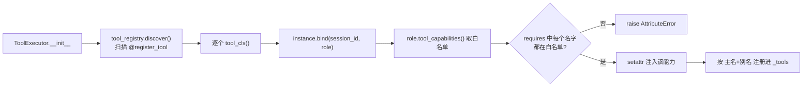

---

## 八、CommandChannel：协议分流（XML vs Native）

`CommandChannel` 是吸收协议差异的策略接口（`common/base/command_channel.py`），让 ReAct 循环对协议无感。

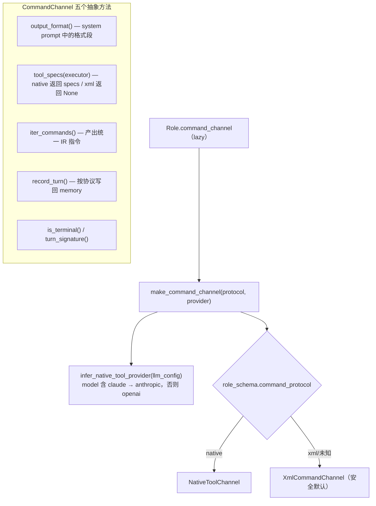

| 维度 | XmlCommandChannel | NativeToolChannel |
|---|---|---|
| 指令载体 | 响应文本中的 XML 块 | LLM 原生 `tool_calls`（JSON） |
| `tool_specs` | `None`（不走 specs） | `executor.get_native_tool_specs(provider)` |
| `record_turn` | 1 条 assistant 文本 + 1 条合并的 outputs | assistant(tool_calls) + 每个调用 1 条 tool_result（按 id 配对） |
| `is_terminal` | 恒 False（靠 End 工具 deactivate 终止） | `tool_calls == []`（纯文本回复即终止） |
| 去重信号 | 原始响应文本 | 结构化调用的 JSON 签名 |
| 参数类型 | **全部当字符串**（仅支持标量参数） | 结构化 JSON Schema（支持嵌套模型） |

> ⚠️ **重要约束**：XML 协议不携带参数类型，结构化参数（list/dict/model）只在 native 通道正确工作（`base_tool.py:40-45`）。设计带结构化参数的工具时需限定 native。

媒体（图片/PDF）处理：工具把占位文本放进 `tool_result`，真实 base64 放进 `executed[].images/pdfs`，由 `_media_message()` 组装成独立的多模态 user 消息（`common/base/command_channel.py` 末尾的 `_collect_media` / `_media_message`）。

---

## 九、Router：三种路由 + 故障恢复

`LLMRouter` 取代了旧的 `LLM()` 工厂，统一三种选模型方式（`router/router.py`）。

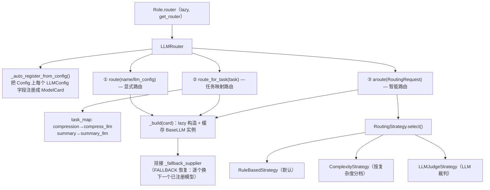

三种路由的用途：
- **显式**：调用方直接给 `LLMConfig` 或模型名（等价旧 `LLM()` 工厂）。
- **任务映射**：声明任务类型，由 `task_map` 选模型——如 `ContextManager` 的压缩走 `compression` 任务、`Role.end_session` 的总结走 `summary` 任务，可用更便宜的模型（`router.py:30-40, 186-192`）。新增任务路由只需在 `DEFAULT_TASK_MODELS` 加一行 + Config 加字段，**无需写分支**。
- **智能**：把请求信号交给可插拔 `Strategy` 选档（`router.py:200-220`）。

**故障恢复（RecoveryRunner）**：在 provider 层包了一圈恢复逻辑，把 COMPRESS / ROTATE_CREDENTIAL / FALLBACK / SHRINK_IMAGE 等做成**注入式回调**，不依赖 router/context，避免循环依赖（`router/llm/recovery.py`）。`make_fallback_supplier()` 返回一个有状态闭包，逐个交出未尝试过的已注册模型，耗尽则重新抛出（`router.py:148-171`）。

---

## 十、ContextManager：历史压缩与请求组装

`ContextManager` 取代旧 `Memory`，既是会话历史的存储（实现 `MessageStore` Protocol），又是上下文窗口的压缩编排器（`context/`）。

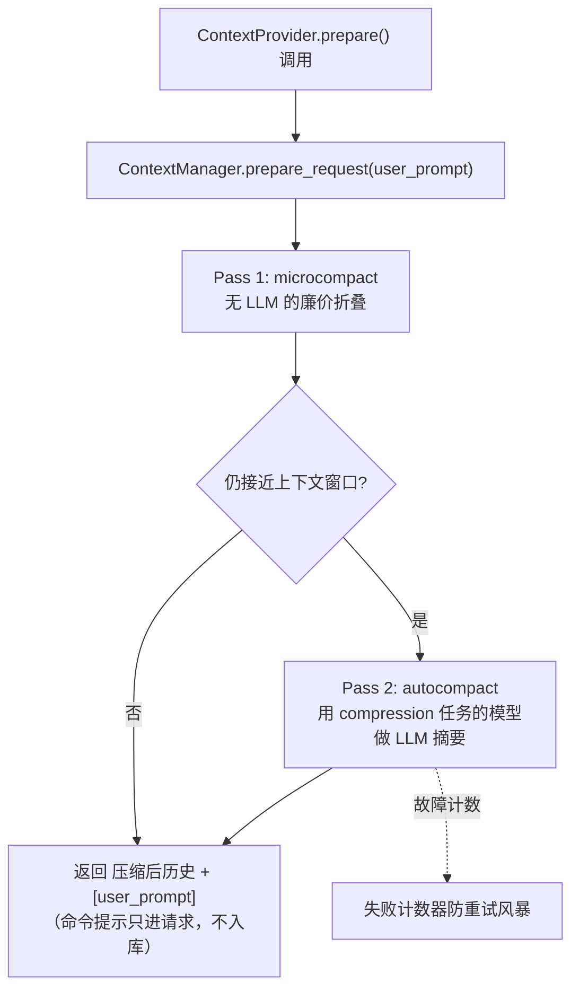

设计要点：
- **按成本排序的 reducer 流水线**：`erase`/`fold`/`spill`（均 FREE）→ `summarize`（LLM）→ `drop`（DESTRUCTIVE），cheapest-first 且达标即停。其中 `OversizedSpillReducer`（`context/compaction/reducers/spill.py`）无损落盘超大单条内容（消息正文 / tool-call args）——复用工具路径的 `enforce_tool_result_limit`（经会话 `WorkspaceStore` 落盘），把 fold/erase/summarize/drop 都够不到的失控单条替换成 `<persisted-output>` 指针，可再读回。
- **两段式压缩**：先做不花钱的 microcompact，必要时才触发 LLM autocompact（`context/manager.py:129-191`）。
- **压缩用独立模型**：autocompact 的摘要走 router 的 `COMPRESSION_TASK`，与主模型解耦、可用更便宜的模型（`role.py:220-226`）。
- **命令提示不落库**：`prepare_request` 返回的是"历史 + user_prompt"的新列表，命令提示只附加到请求，不写入存储历史（`provider.py:140-151`）。

---

## 十一、Environment：多 Agent 控制平面

`environment/` 是全框架最成熟的模块，移植自 Codex 的控制平面，由五个原语组合（`environment/control.py:1-24`）。

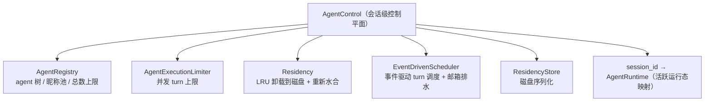

**消息投递流程**（`control.py:184-217`）：

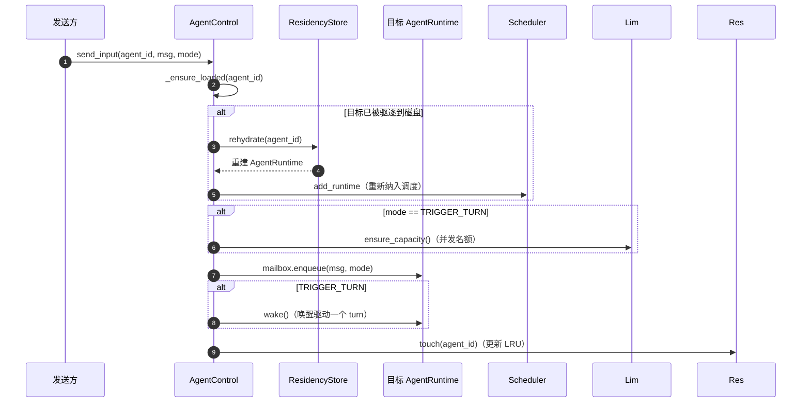

**两种投递模式**（`mailbox.py`）：
- `TRIGGER_TURN`：入队后立即唤醒目标 agent 跑一个 turn。
- `QUEUE_ONLY`：只入队，目标在自己下一个 turn 边界才看到——用于子 agent 完成通知，避免打断父 agent 当前 turn。

**完成观察者**（`control.py:267-317`）：父 agent 派生子 agent 后，`start_completion_watcher` 启一个用 **weakref** 持有控制平面的协程，轮询子 agent 直到终态，再以 `QUEUE_ONLY` 投递完成通知给父 agent。weakref 确保控制平面被回收时观察者自动退出，不造成引用循环。

---

## 十二、EffectLedger：外部副作用幂等台账与崩溃对账

**要解决的问题**：一个 EXTERNAL 副作用工具（网络 / 子进程 / IPC / 人机交互 / 派生 agent）没有本地可回滚的前像快照。若进程在“副作用已发生、但 tool_result 消息尚未持久化”之间崩溃，朴素 resume 会重放该调用 → **副作用重复执行**（重复下单、重复发消息）。ContextManager 的 pairing 不变式只保证配对不断裂，救不了“副作用是否已生效”这层语义。

**两段协同**（都挂在 `ToolExecutor.run_command` 这一个 chokepoint 上）：

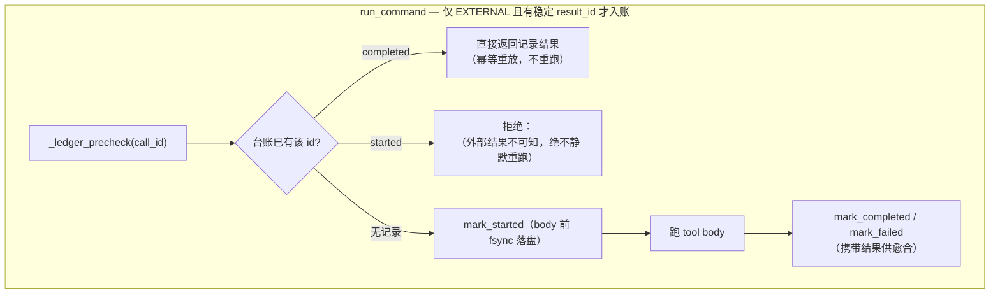

- **① 存储**（`executor/effect_ledger.py`）：per-`(session, tool_call_id)` 的 append-only JSONL（`ledger/effects.jsonl`，经 `WorkspaceStore` 落到会话目录，随会话清理）。读时 fold 成 latest-per-id 索引；`unresolved()` 精确列出崩溃时仍是 `started` 的调用。`mark_started` 在 body 前 fsync，`mark_completed/failed` 把最终结果写进记录供后续愈合。
- **② ToolEffect 分类**（`executor/base_tool.py:resolve_effect`）：显式 `effect` 优先 → `mutates_filesystem` 派生 `LOCAL`（已被快照层保护）→ 其余保守判 `EXTERNAL`（未知副作用面默认入账）。只读工具（Read/Grep/Glob）显式声明 `effect = PURE` 退出台账。注意 `reconstructable` 不参与判定（Bash 可重建结果但仍是 EXTERNAL）。

**为什么没有“幂等键”这一层**：幂等是**接口提供方**的职责，不是台账能替它实现的。一个 EXTERNAL 副作用崩溃在半途时，它是否已生效对框架而言**物理上不可知**——框架无权替远端断言“可安全重跑”。所以台账只做一件诚实的事：如实记录 `started` 并在 resume 时上报 `<unknown-after-crash>`，把“核验 / 重试 / 放弃”的决策权交给模型。曾经的 `idempotency_key` / `annotate_tool_effect` 抽象是一层框架替提供方猜测的死抽象，已删除。

**执行前持久化检查点**（第七节，`react_loop.py`）：ReAct 循环把 `record_turn` 拆成 `record_call`（assistant 的 tool_calls 消息）+ `record_results`（各工具结果）。本轮含 EXTERNAL 台账工具时，**先** `record_call` 并 `drain()` 落盘，**再**执行 body。这保证崩溃时 durable 历史里已有悬空 tool_call —— 否则连“悬空调用”都不存在，对账无从谈起。

**Resume 对账**（`session/reconcile.py` + `roles/session_manager.py`）：`replay()` 重建历史后，`reconcile_tool_calls(messages, ledger)` 扫描悬空 tool_call（assistant 请求了但历史里无配对 tool_result），逐个查台账并注入合成 tool_result（恢复 provider 配对不变式）：

| 台账状态 | 语义 | 注入内容 |
|---|---|---|
| `completed` / `failed` | 副作用已完成，只是结果消息丢了 | **愈合**：台账记录的真实结果，**不重跑** |
| `started` | 崩溃时在途，外部结果不可知 | `<unknown-after-crash>`：绝不静默重跑，由模型核验后决定 |
| 无记录 | PURE/LOCAL，从未入账 | `<not-executed>`：安全重放 |

对账成功后 `ledger.reap(resolved_ids)` 清理已解决记录，台账不随会话无限增长。层次上 `session` 通过窄结构协议 `LedgerView`（只 `status`）读台账，不反向依赖 `executor`；对账函数是纯函数，从不改台账，只返回待 reap 的 id 集。

**bggraph 协同**：`run_graph` 前台运行在**一次**顶层 `run_command` 内，其自身 EXTERNAL 台账条目就是崩溃恢复单元（resume 只对账这一个顶层调用）。图内节点分派（`Role.dispatch_tool`）**刻意不传 result_id**、不逐节点入账——因为图内调用从不作为 tool_calls 出现在 durable 历史里，对账器永远够不到它，逐节点入账的 `started` 记录会永久泄漏。于是形成两级保护：**图内** = 节点级重放（暂停/恢复只重跑未完成节点），**图整体** = 顶层台账条目。

**默认开启**：`EffectLedgerConfig.enabled = True`（`common/schema/tool_config.py`）。YAML 开关在 `tools.effect_ledger`，由 `_build_executor` 从 `role.config.tools.effect_ledger` 读入并传给 `ToolExecutor`（与兄弟 `ToolResultLimitConfig` 同构、并列挂在 `tools.result_limit`：都是 tool-exec-scope 的纯数据策略，executor 是唯一属主——compaction 的 spill reducer 复用 executor 借出的同一个 `result_limit` 实例，单一来源无漂移）。

---

## 十三、扩展点速查表

| 想做的扩展 | 怎么做 | 关键文件 |
|---|---|---|
| **加一个工具** | 继承 `BaseTool`，写 `call(**kwargs)`，`@register_tool` 装饰，schema 自动生成 | `executor/base_tool.py`、`executor/tool_registry.py` |
| **工具需要 Role 能力** | 在工具上声明 `requires=("get_cwd", ...)`，并在 `Role.tool_capabilities()` 发布该能力 | `executor/base_tool.py:77`、`roles/role.py:360` |
| **接一个新 LLM provider** | 继承 `BaseLLM` 实现抽象方法，`@register_provider([...])` | `router/llm/base_llm.py`、`router/llm/llm_provider_registry.py` |
| **加一种路由策略** | 实现 `RoutingStrategy.select()`，`router.set_strategy()` 注入 | `router/strategy.py`、`router/router.py:114` |
| **加一个任务路由** | 在 `DEFAULT_TASK_MODELS` 加一行 + Config 加 `LLMConfig` 字段 | `router/router.py:37-40` |
| **加一种命令协议** | 实现 `CommandChannel` 五个抽象方法，在 `make_command_channel` 分流 | `common/base/command_channel.py`、`parser/native_channel.py:94` |
| **换 ReAct 循环策略** | 实现 `BaseLoop`，在 `Role._make_loop()` 选择（当前固定 ReActLoop，已留注释） | `common/base/loop.py`、`roles/role.py:523` |
| **加一个后台任务工具** | 工具返回 `BgTaskResult`，由 `BackgroundTaskPool` 接管 | `tasks/pool.py`、`tool_executor.py:147-150` |
| **多 agent 编排** | 用 `AgentControl` 注册 runtime、`send_input`/`send_inter_agent_communication` 投递 | `environment/control.py` |

---

## 附：一句话记住整体数据流

```
用户消息
  → Role.run() 入 msg_buffer
  → ReActLoop.run() 观察并写入 memory
  → [循环] ContextProvider.prepare() 组装请求（ContextManager 压缩历史）
  → Router 选模型 → ThinkEngine 调 LLM → ThinkResult
  → CommandChannel 解析出指令 → ToolExecutor 逐个执行 → 写回 memory
  → 终止条件满足 → 返回 AIMessage → publish 回环境
```

> **设计精髓**：把"可扩展的接缝"放在工具、协议、路由、循环、环境这五处，每处都用「抽象基类/Protocol + 注册表/工厂 + 依赖注入」组合实现，使得主流程（ReAct 循环）在任何一处被替换时都保持不变。
</content>
</invoke>
