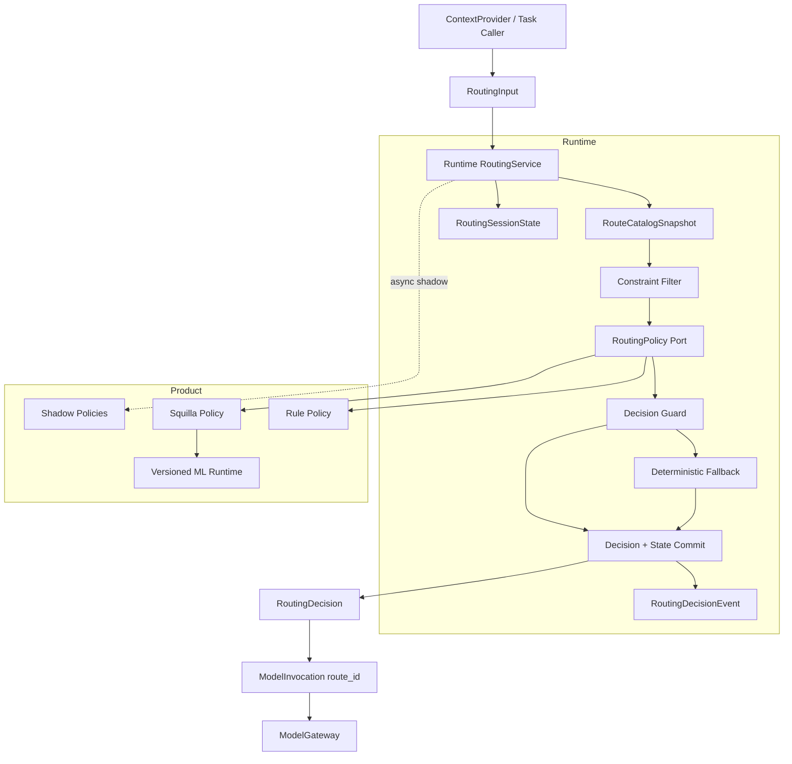
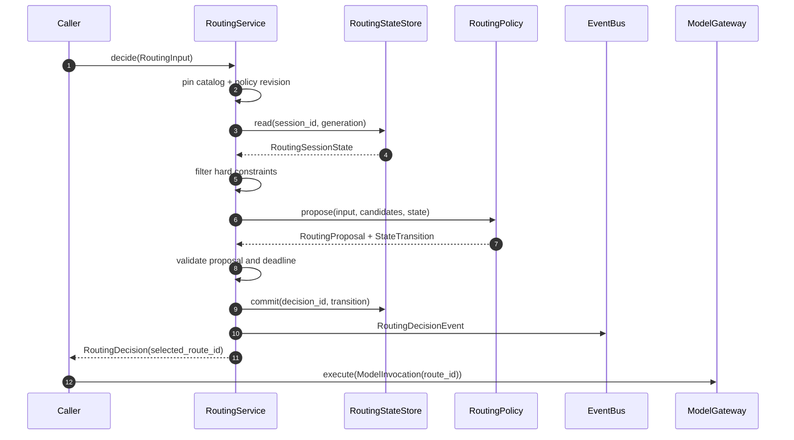
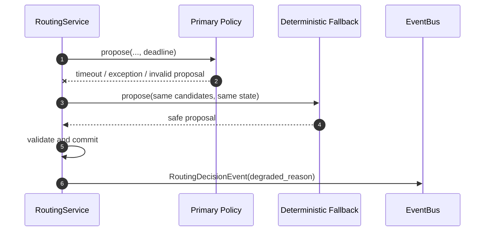

# Model Router 十年形态架构

> 状态：目标架构（Target Architecture）  
> 范围：Mote 的模型选择决策面，包括请求信号、候选目录、规则/ML 策略、会话路由状态、人工控制、决策观测与灰度发布  
> 不包含：provider SDK、wire envelope、凭据轮换、endpoint failover、单次模型调用执行；这些由 `ModelGateway` 及 provider adapter 链路负责  
> 分层约束：`contracts <- kernel <- runtime <- orchestration <- product`  
> 部署基线：单 Python 进程内嵌路由；远端路由服务只作为未来可选 adapter，不是默认前提

> 实现基线（2026-07-26）：主链切换已完成。版本化 Contracts、不可变 Catalog、
> hard-constraint guard、deadline/fallback、Role-owned state、session fact/replay、
> Squilla Contracts policy、Gateway decision correlation、Product-owned ML generation
> runtime、prewarm/atomic activation/drain/Engine shutdown 均已落地；旧 `ModelCard`、
> `RoutingRequest`、`select()`、隐藏 history/seed/hold store、process-global ML engine
> 与 legacy adapter 已删除。Shadow policy 与远端 policy adapter 属于可选后续扩展，
> 不在当前默认运行路径中。

配置切换是有意的 fail-fast 变更：只要任一 agent 的 `strategy` 非 `null`，就必须同时
声明 `router.routes`、`models.routes.semantic`、合法 candidate/default；Squilla 还必须
提供完整且与 route `quality_class` 一致的 R0-R3 映射。旧的“从 default/tasks 自动生成
cards”配置不会被静默兼容或自动扩池。

---

## 1. 结论

Router 需要新的基础设施设计，但不需要推翻现有 Rule、Complexity 和 Squilla 算法。

长期主路径应当是一个独立的、只负责决策的 `RoutingService`：

1. 调用方产生 provider-neutral、版本化的 `RoutingInput`；
2. Runtime 从不可变 `RouteCatalogSnapshot` 中取得本次允许参与决策的逻辑 route；
3. hard constraints 在策略评分前完成，禁止策略或人工 hold 绕过；
4. Product-owned policy（Rule/Squilla/未来策略）只对合法候选评分并返回 `RoutingProposal`；
5. Runtime guard 在统一 deadline 下校验 proposal，失败时执行确定性 fallback；
6. Router 提交结构化 `RoutingDecision` 与状态变更事实；
7. 下游把 `selected_route_id` 写入 `ModelInvocation.route_id`，交给 `ModelGateway` 执行。

Router 不构造 provider client，不管理 credential，不重试 wire request，不遍历 endpoint 做 failover，也不持有 secret-bearing `LLMConfig`。

现有 Squilla 的复杂度模型、complaint upgrade、anti-downgrade、large-context floor、spawn seed 等策略可以保留，但必须从“带隐藏内存状态的模型选择器”改造成“在稳定输入和显式状态上产生可验证 proposal 的 policy”。

---

## 2. 当前实现的有效基础

当前代码已经具备若干正确方向，应当继承而不是重写：

- `RoutingStrategy` 是窄策略接口，Rule 与 Squilla 可替换；
- Squilla 位于 Product，通过 composition root 注入 Runtime，符合分层约束；
- ML bundle 不可用或推理失败时能够退化到确定性 heuristic；
- main agent 与 sub-agent 可以独立选择 routing strategy；
- Squilla 已有 probability、margin、difficulty、thinking mode、prompt policy 和原因信息；
- routing history、seed floor、operator hold 已经验证了跨 turn 状态的业务价值；
- 约 75 MB 的 ML runtime 已避免按 Role 重复加载。

这些能力的问题主要不在算法，而在候选数据、状态归属、调用边界和观测闭环。

---

## 3. 当前机制为何不能继续扩建

### 3.1 生产候选目录使智能路由基本退化

`LLMRouter._auto_register_from_config()` 将以下对象全部注册为 `ModelCard`：

- `models.default`；
- `models.tasks` 中的 compression、summary、web_search、image_description；
- declarative endpoints。

自动创建的 card 没有设置路由元数据，因而统一使用：

```text
tier = 1
context_window = None
description = ""
tags = set()
```

结果是：

- cheap/strong 无法区分；
- long-context 分支没有可用窗口；
- R0-R3 映射到同一个 tier，常退化为选择插入顺序第一张 card；
- task 专用模型进入普通交互候选池；
- endpoint failover 候选与语义模型路由候选混为一组。

现有 router 测试主动清空自动注册的 cards，并注入 tier 0-3、不同 context window 的理想化 fixture。因此测试证明了策略在理想候选集上可运行，但没有验证生产配置能构造出这样的候选集。

### 3.2 Router 输入没有表达真实调用要求

主推理链当前只构造：

```python
RoutingRequest(messages=wire, session_key=role.session_id)
```

没有稳定传递：

- task 与 model operation；
- native tools、native schema、vision、PDF、server web search 等要求；
- 输出契约与严格格式要求；
- latency、quality、cost budget；
- governance domain、region、data classification；
- 当前 turn、历史 route decision、上一轮 usage；
- 调用方声明的风险和业务优先级。

虽然 `RoutingRequest` 定义了 `requires_vision`、`requires_pdf`、`prefer_cheap` 和 free-form flags，但生产主链并未可靠填充它们。

### 3.3 候选限制存在 fail-open

当前显式 candidates 过滤结果为空时，会通过：

```python
cards = self._candidate_cards(candidates) or dict(self._cards)
```

重新扩大成全部 cards。

显式白名单为空、候选名拼错或配置 revision 不一致时，Router 必须 fail closed：返回 typed unavailable decision，或选择事先声明的 safe default。禁止静默扩大范围。

### 3.4 Hard constraints 可以被绕过

当前约束处理存在以下问题：

- PDF 与 vision 共用 `supports_vision`；
- 没有满足能力的 candidate 时仍可能返回不满足要求的 default；
- Squilla operator hold 在 capability filter 之前执行；
- free-form `prefer_cheap` 可与高风险信号产生不稳定优先级；
- 策略可以返回候选集中不存在的名称，直到后续 client build 才失败。

能力、治理、地域、上下文窗口和输出协议属于 admissibility，不属于模型评分。任何 policy、人工 hold 或 fallback 都不得绕过它们。

### 3.5 Route class 到 card 的比例映射不稳定

Squilla 当前将 R0-R3 按候选集合里“当前存在的 distinct tier 数量”做比例投影。

这意味着只增加、删除或禁用一张 card，就可能改变其他 route class 的真实目标，即使 policy 和请求完全相同。该映射无法回放，也无法解释配置变更前后的行为。

长期设计必须显式声明：

```text
R0 -> interactive.low
R1 -> interactive.standard
R2 -> interactive.strong
R3 -> interactive.max
```

每个逻辑 route 再由 ModelGateway 的配置映射到自己的 endpoint/failover group。

### 3.6 决策信息没有进入执行与事实链

Squilla 已计算：

- base/final route class；
- probabilities、margin、difficulty；
- thinking level；
- prompt policy 与 prompt hint；
- flags、ML/fallback、sticky/aux 状态。

但主链调用 `aroute()` 后只取得 LLM client，`RoutingDecision` 被丢弃。结果是：

- thinking/prompt policy 没有成为调用约束；
- rollout 无法回答某次调用为什么选择该模型；
- 无法关联最终质量、成本和 latency；
- 无法 shadow 新策略或离线评估；
- confidence 的真实含义无法审计。

### 3.7 会话状态不可恢复、不可回放

Routing history、seed floor 和 control hold 都保存在策略对象的进程内字典中：

- session resume 后丢失；
- worker/进程切换后丢失；
- 无法从 rollout 重建；
- 使用 `time.monotonic()` 的值不能跨进程持久化；
- 状态 mutation 与 decision 没有统一提交边界。

同时 Squilla 的 ML `InferenceRequest` 支持 `prev_route_decisions` 与 `prev_assistant_usage`，当前却固定传空值，导致历史特征通道未真正接入生产事实。

### 3.8 ML runtime 缺少正式生命周期与 SLO

以下是迁移前问题；本轮已通过 Product-owned `RoutingModelRuntime` 解决生命周期、
generation pin、off-loop inference、非阻塞 admission、原子切换和 shutdown drain。
manifest digest/feature compatibility 的完整供应链校验仍属于后续 artifact activation
工作，不应重新塞回 policy。

当前 shared engine 是 module-level dict：

- 第一次真实请求可能同步加载约 75 MB bundle；
- CPU 推理同步运行在 async 调用路径；
- 没有统一 inference deadline 和并发上限；
- 没有 bundle generation、原子热切换与 drain；
- 加载失败后当前实例永久 disabled；
- inference failure 只有 warning 与 `ml=False`，没有结构化 degraded reason；
- artifact manifest 只检查部分维度，没有完整 digest/兼容性身份。

高可用不等于“捕获异常后继续”。还必须保证路由延迟有界、降级可见、版本可定位、切换可回滚。

---

## 4. 目标与非目标

### 4.1 目标

- **决策纯粹**：Router 只选择逻辑 route，不执行模型调用。
- **候选守恒**：显式候选集绝不被静默扩大。
- **约束优先**：能力和治理先过滤，质量/成本/复杂度后评分。
- **配置稳定**：一次 decision 只观察一个 catalog/policy revision。
- **可恢复**：会话 routing state 可以随 RoleState 或 session facts 恢复。
- **可回放**：相同 input、state、candidate revision 和 policy revision 可以重放决策。
- **有界延迟**：任何 policy 都在 routing deadline 内完成，超时确定性 fallback。
- **降级透明**：ML unavailable、timeout、invalid output、fallback 都是 typed fact。
- **可灰度**：支持 shadow、按 agent kind/tenant/session 百分比切流和即时回退。
- **可观测**：每次决策可以与后续 model call、cost、latency 和 outcome 关联。
- **扩展隔离**：新增 policy 不修改 RoutingService 主状态机。
- **无秘密数据**：Router 永远不接触 API key、OAuth token 或完整 provider config。

### 4.2 非目标

- 不在 Router 内处理 endpoint retry、credential rotation、breaker 或 quota recovery。
- 不在第一阶段建设远端 routing 微服务。
- 不在在线请求路径中自动训练或即时修改模型参数。
- 不承诺仅凭一个 scalar tier 完成完整多目标优化。
- 不让 ML policy 直接绕过 Runtime 的 hard constraints。
- 不把 prompt 全文默认写入 routing event；事件必须符合数据最小化原则。

---

## 5. 设计原则与不变量

### 5.1 Router 选择 route intent，Gateway 执行 route

Router 的输出是逻辑 `route_id`。一个 route 可以对应一个或多个 provider endpoints，但 Router 不感知其凭据、SDK client 或 attempt cursor。

```text
Router:       这个请求应进入 interactive.strong
ModelGateway: interactive.strong 当前允许尝试 endpoint A -> endpoint B
```

### 5.2 Hard constraints 永远在 policy 之外守护

Runtime 在 policy 前生成 admissible candidates。Policy 只能对该集合排序或选择。

Runtime 在 policy 后再次验证：

- selected route 存在；
- selected route 属于本次 admissible set；
- decision revision 与 input snapshot 一致；
- proposal 没有违反人工控制权限；
- decision 未超过 deadline。

### 5.3 Policy 是 proposal，不是最终权限

Rule、Squilla、LLM judge 或未来远端 router 返回 `RoutingProposal`。只有 Runtime guard 可以生成最终 `RoutingDecision`。

这使 ML bug、plugin bug、模型输出错误和过期配置都不能直接扩大调用权限。

### 5.4 状态显式进入，变更显式产出

Policy 不直接修改隐藏 store：

```text
decide(input, candidates, state) -> proposal + state_transition
```

RoutingService 验证并提交 state transition。Policy evaluation 失败时不得留下半次 history append、hold decrement 或 seed mutation。

### 5.5 决策版本完整

一次 decision 至少绑定：

- `routing_input.schema_version`；
- `feature_schema_revision`；
- `catalog_revision`；
- `policy_id` 与 `policy_revision`；
- ML bundle digest（如果使用）；
- state generation；
- decision id。

缺任一版本都无法可靠重放或比较策略。

### 5.6 降级路径必须比主策略简单

默认 fallback 应为同步、确定性、无外部网络依赖的 rule policy。

禁止：

- Squilla 失败后调用另一个 LLM judge；
- routing timeout 后访问远端配置中心；
- fallback 重新扩大 candidate set；
- fallback 选择不满足 hard constraints 的 default。

### 5.7 决策事实与控制分离

EventBus 只记录已发生的 `RoutingDecisionEvent`，subscriber 不反向参与当前 decision。Policy、guard、state store 通过直接 typed call 协作。

---

## 6. 总体架构



### 6.1 正常时序



### 6.2 Policy 失败时序



---

## 7. 分层归属

### 7.1 Contracts

只放跨边界数据、错误、事件与 Protocol：

```text
contracts/models/routing.py
    RouteId
    RoutingInput
    RouteCandidate
    RoutingRequirements
    RoutingProposal
    RoutingDecision
    RoutingSessionState
    RoutingStateTransition
    RoutingDegradedReason

contracts/events/routing.py
    RoutingDecisionEvent
    RoutingPolicyActivationEvent

contracts/errors/routing.py
    RoutingUnavailableError
    RoutingPolicyTimeoutError
    RoutingProposalInvalidError

contracts/ports/routing.py
    RoutingPolicy
    RoutingStateStore
```

Contracts 不 import Runtime、Product、numpy、provider SDK 或 `LLMConfig`。

### 7.2 Kernel

Kernel 负责从执行语义产生 provider-neutral routing intent：

- 当前 task/operation；
- output requirements；
- 是否需要 tools/media/schema；
- token estimate 与上下文信号；
- 风险、优先级与 caller hints；
- 将 `RoutingDecision.selected_route_id` 写入 `ModelInvocation`。

Kernel 可以包含纯规则 feature extraction，但不得加载 ML bundle 或 Product policy。

### 7.3 Runtime

Runtime 拥有：

- `RoutingService` 主状态机；
- immutable route catalog snapshot；
- hard constraint filter；
- deadline、proposal guard 与 deterministic fallback；
- routing state 的读取和提交；
- decision event 与 session fact；
- policy generation 生命周期。

Runtime 只依赖 Contracts port，不 import Product Squilla。

### 7.4 Product

Product 拥有：

- Rule、Complexity、Squilla 等具体 policy；
- ML feature pipeline 与 bundle loader；
- policy factory/catalog；
- Product 默认的 R0-R3 route mapping；
- bundle prewarm、generation activation 和 optional shadow policy。

---

## 8. 核心契约

以下为方向性契约草案，字段名可在实现期调整，但语义边界不得退化。

### 8.1 RouteCandidate

Router candidate 描述逻辑 route，不描述 provider client：

```python
class RouteCandidate(FrozenModel):
    route_id: str
    quality_class: str
    cost_class: str
    latency_class: str
    context_tokens: int
    capabilities: RouteCapabilities
    governance_domain: str
    allowed_regions: frozenset[str]
    tags: frozenset[str]
    enabled: bool
```

禁止字段：

- API key；
- OAuth 配置；
- SDK client；
- credential slot；
- mutable health cursor；
-完整 `LLMConfig`。

### 8.2 RoutingInput

```python
class RoutingInput(FrozenModel):
    schema_version: Literal[1]
    decision_id: str
    model_call_id: str
    session_id: str
    turn_id: int
    task: str
    operation: ModelOperation
    requirements: RoutingRequirements
    signals: RoutingSignals
    caller_hints: RoutingHints
    trace: TraceContext
```

`RoutingSignals` 至少覆盖：

- token estimate；
- conversation turns；
- previous failures；
- previous route/outcome summary；
- prompt complexity features；
- tool/media/output characteristics；
- remaining budget bucket；
- latency/quality priority。

自由文本是否进入 Product policy 应由明确的 data policy 决定。事件中默认只记录 feature/reason，不复制完整 prompt。

### 8.3 RoutingProposal

```python
class RoutingProposal(FrozenModel):
    selected_route_id: str
    policy_id: str
    policy_revision: str
    feature_schema_revision: str
    base_class: str | None
    final_class: str | None
    confidence: float | None
    scores: tuple[CandidateScore, ...]
    reason_codes: tuple[str, ...]
    explanation: str
    state_transition: RoutingStateTransition
```

Proposal 不是最终权限，必须经 Runtime guard。

### 8.4 RoutingDecision

```python
class RoutingDecision(FrozenModel):
    schema_version: Literal[1]
    decision_id: str
    selected_route_id: str
    policy_id: str
    policy_revision: str
    catalog_revision: str
    state_generation: int
    status: Literal["selected", "fallback", "held"]
    degraded_reason: RoutingDegradedReason | None
    base_class: str | None
    final_class: str | None
    confidence: float | None
    reason_codes: tuple[str, ...]
    latency_ms: float
```

`fallback: bool` 不足以区分：

- ML bundle unavailable；
- inference timeout；
- policy exception；
- invalid proposal；
- no admissible candidates；
- low confidence default；
- operator hold。

必须使用 typed status/degraded reason。

### 8.5 RoutingSessionState

```python
class RoutingSessionState(FrozenModel):
    generation: int
    recent_decisions: tuple[RecentRoutingDecision, ...]
    seed_floor: SeedFloor | None
    control_hold: RoutingHold | None
```

State transition 应表达：

- append recent decision；
- create/consume/expire seed；
- set/decrement/clear hold；
- clear state on explicit lifecycle boundary。

Policy 不直接 mutation store。

---

## 9. Candidate Catalog 设计

### 9.1 三种集合必须分离

```text
Task routes
    compression / summary / web_search / image_description

Semantic routing pool
    interactive.low / standard / strong / max

Failover groups
    route 内允许尝试的 provider endpoints
```

它们可以引用同一 endpoint，但不能通过“注册在同一个 dict”隐式互相加入。

### 9.2 显式 class mapping

配置示意：

```yaml
router:
  policies:
    main:
      kind: squilla
      class_routes:
        R0: interactive.low
        R1: interactive.standard
        R2: interactive.strong
        R3: interactive.max
    sub:
      kind: squilla
      class_routes:
        R0: sub.low
        R1: sub.standard
        R2: sub.strong
        R3: sub.max
```

映射必须在 config activation 阶段验证：

- 四个 class 是否完整；
- route 是否存在且 enabled；
- default route 是否在 admissible pool；
- route capabilities 是否与声明一致；
- mapping 不包含 task-only route。

### 9.3 Catalog snapshot

每次配置激活生成 immutable snapshot：

```text
RouteCatalogSnapshot
    revision
    candidates
    class mappings
    policy bindings
    defaults
```

一次 decision 只读取一个 snapshot。配置 reload 只影响之后的新 decision。

---

## 10. Constraint Filter 与 Decision Guard

### 10.1 Filter 顺序

建议固定为：

1. enabled 与显式 candidate scope；
2. governance domain、region、data classification；
3. operation 与协议能力；
4. tools、schema、vision、PDF、web search；
5. minimum context window；
6. caller hard budget/latency ceiling；
7. policy scoring。

前六步不允许 policy 修改。

### 10.2 无合法候选

没有 admissible candidate 时应返回 typed `RoutingUnavailableError` 或 unavailable decision，包含：

- catalog revision；
- candidate ids；
- 每个 candidate 缺失的 constraint；
- safe detail，不包含 secret。

禁止返回能力不足的 default。

### 10.3 Operator hold

Hold 表达人工选择意图，但仍需经过 hard constraints：

```text
hold target 合法且 admissible -> held decision
hold target 存在但不 admissible -> reject hold for this call, emit reason
hold target 已从 catalog 删除 -> expire/clear hold
```

人工 override 可以提升质量或固定 route，不能绕过治理和能力边界。

---

## 11. Policy 执行模型

### 11.1 RoutingPolicy Port

```python
class RoutingPolicy(Protocol):
    policy_id: str
    policy_revision: str

    async def propose(
        self,
        routing_input: RoutingInput,
        candidates: tuple[RouteCandidate, ...],
        state: RoutingSessionState,
    ) -> RoutingProposal:
        ...
```

新增 policy 只需实现 port 并在 Product composition root 注册。Runtime RoutingService 不增加 `if kind == ...` 分支。

### 11.2 Deadline

RoutingService 为每次 policy evaluation 提供独立、远小于 model call 的 deadline。

原则：

- Rule policy 应在微秒/低毫秒级完成；
- 本地 ML 应有明确 p50/p95/p99；
- 超时立即取消并转 deterministic fallback；
- shadow policy 不得占用主 decision deadline；
- 远端 policy adapter 必须比模型调用拥有更严格的 timeout 和 breaker。

### 11.3 Fallback

Fallback policy 必须：

- 无网络依赖；
- 不加载重型模型；
- 不扩大 candidates；
- 只使用 typed input 与候选 metadata；
- 输出始终经过同一个 guard。

### 11.4 Confidence 语义

当前 probability top-1 confidence 在 flag floor、complaint upgrade、anti-downgrade 或 large-context floor 后，未必对应最终 class。

新契约应区分：

- `base_confidence`：原始 scorer 对 base class 的校准概率；
- `final_class`：经过 policy rules 的最终 class；
- `final_selection_kind`：score / floor / hold / fallback；
- `confidence=None`：最终选择不是概率意义上的输出时，避免伪精确。

---

## 12. Squilla 迁移设计

### 12.1 保留

- feature extraction；
- ML ensemble；
- heuristic fallback；
- flag floors；
- complaint upgrade；
- anti-downgrade；
- large-context floor；
- thinking/prompt derivation；
- spawn seed 的业务语义。

### 12.2 调整

- `_pick_card_for_route()` 替换为显式 class-to-route mapping；
- history、seed、hold 从实例字典改为 `RoutingSessionState`；
- `prev_route_decisions` 和 `prev_assistant_usage` 从真实 state/facts 构造；
- `time.monotonic()` 通过 Runtime clock/turn ordinal 输入，不在 policy 内自行读取；
- ML error 作为 typed degraded reason 返回；
- `extra: dict` 改为稳定 proposal 字段；
- prompt/thinking output 要么成为下游 typed policy，要么删除，禁止长期计算后丢弃。

### 12.3 ML runtime generation

Product 已拥有正式 `RoutingModelRuntime` lifecycle resource：

```text
load candidate generation
    -> build runtime objects
    -> prewarm candidate off-loop
    -> publish ready generation
    -> atomically activate
    -> drain old generation
    -> close/unload old generation
```

`ProductContainer.standard()` 创建独立 runtime；同一 Container 的全部 Role/policy 共享它，
`with_plugins()` 复用它，`EngineServices` 在 Context 之前关闭它。一次 policy decision pin
同一 generation 的 engine 与 immutable runtime config，切换不会产生“旧模型预测 + 新配置
后处理”。candidate 构造或 prewarm 失败不改变 active generation；关闭开始后拒绝新 pin，
并等待 active/draining generation 的现有 pin 释放。

proposal 的 `policy_revision` 当前组合记录 policy code revision 与 model revision。bundle
digest、manifest 签名、feature schema compatibility 和 synthetic golden inference 应在未来
artifact activation contract 中一次性补齐；在没有该 contract 前不伪造 digest 字段。

### 12.4 并发

不得依靠“asyncio 单线程 + GIL”作为长期并发契约。

应明确：

- inference 是否 thread-safe；
- ONNX/LightGBM 自身线程数量；
- 进程内最大并发；
- 是否通过受控 executor 执行；
- 队列满时的 fallback；
- shutdown 时如何 drain。

是否 batch inference 由真实 profiling 决定，不预先建设复杂 batcher。

---

## 13. 状态、持久化与恢复

### 13.1 状态归属

Router state 是 Agent/session 的运行时状态，应进入：

- `RoleState` 的可序列化 routing slice；或
- session facts + projection。

不应挂在 `Role` 普通属性、policy 实例或 process global。

### 13.2 原子提交

一次成功 decision 的以下事实应在同一逻辑提交中形成：

- final `RoutingDecision`；
- history append；
- hold decrement/expiry；
- seed consumption/expiry；
- decision event。

如果 policy timeout、guard reject 或调用取消，不得留下半次 state transition。

### 13.3 时间语义

进程内 `monotonic()` 适合 deadline，不适合跨进程持久化 TTL 起点。

建议：

- turn budget 使用 `turn_id/turns_remaining`；
- 可恢复 TTL 使用 UTC deadline；
- 单次执行 deadline 使用 monotonic clock；
- replay 时不伪造已经过去的 monotonic 时间。

### 13.4 Resume

Resume 应恢复：

- recent route decisions；
- active hold 及剩余 turn/UTC expiry；
- seed floor；
- state generation。

Policy/config revision 可以使用当前部署 generation，但新 decision 必须显式记录发生了 revision 变化。

---

## 14. 可观测、评估与灰度

### 14.1 RoutingDecisionEvent

事件至少包含：

```text
decision_id
model_call_id
session_id / turn_id
selected_route_id
policy_id / policy_revision
catalog_revision
feature_schema_revision
state_generation
base_class / final_class
reason_codes
degraded_reason
candidate score summary
routing latency
```

默认不包含完整 prompt、API key 或 provider response。

### 14.2 Outcome correlation

后续 `ModelInvocation`、`ResolvedModelResponse`、cost、latency、tool/output validation 应携带 `decision_id`，使离线系统能回答：

- 不同 route 的真实成本和延迟；
- fallback/ML degraded 频率；
- complaint 是否与之前 decision 相关；
- 强模型是否真的改善成功率；
- 哪个 policy revision 引入回归。

### 14.3 Shadow policy

Shadow policy：

- 读取与主策略相同的 immutable input/candidates/state；
- 不提交 state transition；
- 不影响主请求 deadline；
- 只产生 `RoutingShadowDecisionEvent`；
- 有独立并发与资源预算；
- 可按 session 稳定采样。

当前明确不实现半套 shadow。`RoutingService` 尚没有 Engine-owned 的非阻塞任务 supervisor，
Contracts 也没有 durable、secret-safe 的 `RoutingShadowDecisionEvent`，配置层没有稳定 cohort
与独立 deadline/concurrency budget。直接 `create_task()` 会产生无所有者任务；在主 decision
内 await 又会污染延迟。因此启用 shadow 前必须同时落地：

1. versioned shadow config（policy revision、session cohort、deadline、concurrency）；
2. Engine-owned task supervisor，shutdown 可 drain/cancel；
3. 独立 policy/runtime admission，不能争抢主策略的 inference permit；
4. typed durable comparison event，关联 primary decision/model call，但不含 prompt/secret；
5. 明确保证 shadow proposal 的 transition 永不进入 `RoutingStateStore.commit()`；
6. timeout、queue full、shutdown 和 event commit failure 的测试矩阵。

这六项应作为一个完整变更落地，不能只加一个 policy callback 或 fire-and-forget task。

### 14.4 灰度单位

策略切流应基于稳定 key：

- tenant；
- main/sub agent kind；
- session hash bucket；
- explicit operator cohort。

同一 session 默认固定 policy generation，避免每 turn 随机抖动。

### 14.5 核心指标

- routing latency p50/p95/p99；
- primary policy timeout/error rate；
- ML unavailable/degraded rate；
- fallback rate；
- route distribution；
- hold/seed/constraint override counts；
- selected route 与实际 resolved endpoint 的关联；
- per-route cost、latency、output success；
- shadow disagreement rate。

---

## 15. 配置与热更新

### 15.1 单一配置来源

当前部分阈值在 `SquillaConfig`，部分在 `router.runtime.yaml`。长期应编译为一个 validated policy bundle：

```text
RoutingPolicyBundle
    policy metadata
    thresholds
    flag rules
    class-to-route mapping
    feature schema revision
    optional model artifact identity
```

Runtime 不读取 Product 内部 raw dict。

### 15.2 激活验证

配置激活必须在流量进入前验证：

- policy kind 已注册；
- class mappings 完整；
- referenced routes 存在；
- defaults 合法；
- hard requirements 可以被至少一个 route 满足；
- fallback policy 可构造；
- ML manifest/config/feature schema 兼容；
- shadow policy 资源预算有效。

### 15.3 原子切换

热更新流程：

```text
parse -> validate -> build generation -> prewarm -> publish ready -> atomic swap
```

构造或预热失败时继续使用旧 generation，禁止留下部分更新。

---

## 16. 与 ModelGateway 新链路的边界

Router 与 ModelGateway 通过 `route_id` 对齐：

```text
RoutingDecision.selected_route_id
                  │
                  ▼
ModelInvocation.route_id
                  │
                  ▼
FailoverPlanner / RuntimeModelGateway
```

双方职责不得重叠：

| 问题 | Router | ModelGateway |
|---|---:|---:|
| 任务需要低/中/高质量 route | 是 | 否 |
| 根据 hard requirements 过滤逻辑 route | 是 | 再验证 |
| route 对应哪些 endpoints | 否 | 是 |
| endpoint 健康、凭据轮换、重试 | 否 | 是 |
| provider wire envelope | 否 | 是 |
| session anti-downgrade/hold/seed | 是 | 否 |
| 单次 model call attempt budget | 否 | 是 |

Router 不应读取 Gateway 内部 mutable health cursor。未来若需要 latency/cost-aware routing，应通过本次输入中的只读、版本化 fleet signal snapshot 提供，而不是直接耦合 breaker/ratelimit tracker。

---

## 17. 迁移路线

### Phase 0：冻结边界

- 不再向旧 `LLMRouter` 增加新的策略状态、provider 构造分支或恢复逻辑；
- 明确旧链只承担迁移期兼容；
- 新 router 与同事正在开发的 provider/gateway 链只通过 `route_id` 对接。

### Phase 1：稳定契约与真实 Candidate Catalog

- 新增 Contracts routing DTO/ports/events；
- 建立 secret-free `RouteCatalogSnapshot`；
- 配置显式 R0-R3 route mapping；
- task routes、semantic pool、failover groups 分离；
- 增加 config activation validation。

### Phase 2：RoutingService 与 deterministic guard

- 实现 hard constraint filter；
- 实现 proposal validation；
- 实现 routing deadline；
- 实现 deterministic fallback；
- 生成结构化 decision event；
- 保持实际模型仍由旧路径选择，先不改变行为。

### Phase 3：包装现有策略并 Shadow

- Rule/Complexity/Squilla 适配 `RoutingPolicy`；
- Squilla 改为显式输入/状态/transition；
- shadow comparison 暂缓，等待 §14.3 的完整基础设施；
- 落地后记录 primary 与 shadow proposal 的 typed 差异；
- 使用真实 production catalog 做评估，不再只依赖理想 fixture。

### Phase 4：接入新 ModelGateway

- `RoutingDecision.selected_route_id` 写入 `ModelInvocation.route_id`；
- 小流量切换 main/sub agent；
- 验证 route distribution、cost、latency、quality 与 degraded rate；
- 保留即时切回固定 default route 的开关。

### Phase 5：状态持久化与 ML 生命周期

- routing state 进入 RoleState/session facts；
- resume/replay 恢复 history/hold/seed；
- ML runtime generation、prewarm、atomic swap、drain（已完成）；
- 加入 deadline/concurrency SLO。

### Phase 6：删除旧职责

- 删除旧 `LLMRouter` 的智能选择职责；
- 删除 `ModelCard.llm_config` 路由面；
- 删除隐式 all-card candidate pool；
- 删除 `RoutingDecision.extra`；
- 删除 policy 内隐藏 mutable stores；
- 删除 task model 参与交互路由的兼容行为；
- 不保留永久双链或 re-export 残渣。

---

## 18. 测试与验收标准

### 18.1 Contract tests

- 所有 routing DTO frozen、`extra="forbid"`、JSON round-trip；
- event 不包含 secret；
- policy plugin 只依赖 Contracts；
- unknown policy/source 可通过 string id 扩展，不依赖封闭 Literal 中心枚举。

### 18.2 Candidate tests

- 生产配置能构造至少两个不同质量 class 的 route；
- task-only route 不进入 semantic pool；
- explicit candidate scope 为空时不扩大；
- route disable/reload 不改变同一 pinned snapshot；
- class mapping 增删 route 时语义稳定。

### 18.3 Constraint tests

- vision/PDF/schema/tools 分别验证；
- hold 不绕过 hard constraints；
- default 不满足要求时返回 unavailable；
- governance/region filter fail closed；
- policy 返回越权 route 被 guard 拒绝。

### 18.4 State tests

- decision 与 transition 原子提交；
- cancellation 不消耗 hold/seed；
- resume 后 anti-downgrade、hold、seed 语义保持；
- turn expiry 与 UTC expiry 可重放；
- 不同 session state 完全隔离。

### 18.5 Policy tests

- Rule/Squilla conformance suite；
- invalid/empty/unknown proposal；
- timeout/exception deterministic fallback；
- confidence/base/final class 语义一致；
- ML unavailable、manifest mismatch、inference error 都产生 typed degraded reason。

### 18.6 并发与 SLO tests

- 多 session 并发不共享 mutable decision state；
- ML load 不发生在未预热的主流量路径；
- inference queue 满时有界 fallback；
- shutdown drain 不接受新 inference；
- p95/p99 达到 `runtime-slo.md` 中声明的 routing budget。

### 18.7 Shadow 与 rollout tests

- shadow 不提交 state；
- shadow timeout 不影响主请求；
- 同一 session 稳定落在同一 cohort；
- policy generation rollback 后新 decision 使用旧 generation；
- decision id 能关联 model response、cost 和 output outcome。

---

## 19. 评审红线

以下任一设计出现即应阻止合入：

1. Router 持有 `BaseLLM`、provider SDK client 或 API key；
2. policy 直接修改 Role/RoleState 或隐藏 module global；
3. 显式 candidates 为空后退回全量 catalog；
4. operator hold 绕过 capability/governance；
5. R0-R3 继续按候选数量比例映射；
6. policy error 直接导致 model call 无默认降级；
7. ML load/inference 无 deadline 地阻塞事件循环；
8. decision 未携带 policy/catalog revision；
9. 只记录自然语言 reasons，不记录稳定 reason codes；
10. task route、semantic routing pool 与 failover candidates 再次共享隐式集合；
11. 为迁移永久保留旧/新双路由主链；
12. 为新增 policy 修改 RoutingService 的核心分支。

---

## 20. 最终形态

最终 Router 应具备以下性质：

- 对 Kernel：一个稳定的 `decide(RoutingInput) -> RoutingDecision` port；
- 对 ModelGateway：只交付一个经过约束验证的逻辑 `route_id`；
- 对 Product：Rule/Squilla/未来策略都是可替换 policy plugin；
- 对 Session：history、hold、seed 是可恢复的 typed state；
- 对运维：policy、catalog、ML bundle 都是版本化 generation，可预热、灰度、回滚；
- 对评估：每次 decision 与实际 cost、latency、endpoint 和 outcome 可关联；
- 对高可用：主策略超时或失败不会扩大权限，也不会阻断安全 default；
- 对未来扩展：增加 provider、endpoint、policy 或 ML bundle，不修改 Router 的核心状态机。

这条边界稳定后，Router 可以在十年内持续演进模型质量、成本和延迟策略，而不会重新污染 provider、failover、Kernel 或 Role。
