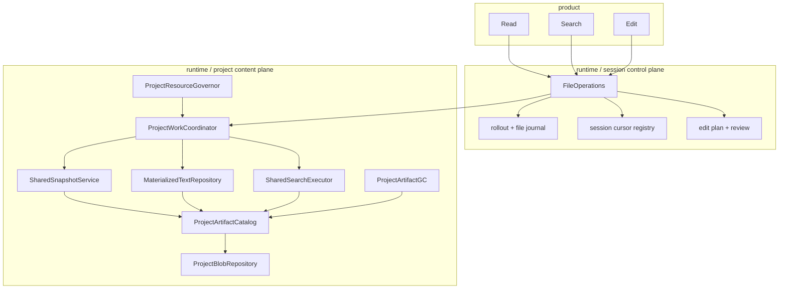

# Project Content Plane：多 Agent 文件内容复用计划

> 状态：**设计完成，尚未开始实施**
>
> 日期：2026-07-24
>
> 范围：单机、多进程、多 Agent 的 Read / Search / EditPlanner 内容获取、文档提取、搜索计算与 artifact 生命周期
>
> 前置架构：[`file-operation-safety-plan.md`](./file-operation-safety-plan.md)

## 0. 决策摘要

当前 File Operations 已经统一了 sealed snapshot、编码、正则语义、事务、跨进程锁、cursor 和 artifact GC，但其组合根仍然是 **per-session**：每个 Agent 拥有独立的 `FileOperations`、`ArtifactRepository`、artifact catalog 和 cursor registry。

这保证了 session 隔离，却导致同一项目中的多个 Agent 重复执行：

- ripgrep 候选发现；
- 源文件双遍 sealed capture；
- snapshot 和 metadata artifact 发布；
- 文本解码；
- PDF / DOCX / XLSX 提取；
- regex 扫描；
- rows / skipped / manifest artifact 生成；
- 独立配额预留与 GC。

本计划引入一个正式的 **Project Content Plane**，把“项目内可按不可变事实复用的内容工作”从 session 控制面抽离：

```text
Project Content Plane（同项目、单机跨进程共享）
├── physical content-addressed storage
├── typed ownership / lease catalog
├── sealed-capture flight coordination
├── materialized-text derivation index
├── search request cohort + result index
├── project resource governor
└── project-level quota / GC / health

Session File Operations（每 Agent 独立）
├── rollout / history
├── transaction / review facts
├── observed versions
├── timeline epoch
├── permission decisions
└── session cursor grants and logical roots
```

核心决策：

1. 同一项目在一台机器上只保存一份物理 content-addressed payload。
2. session 继续拥有自己的历史、事务、cursor 和权限语义，只共享不可变内容。
3. 复用只能由 exact immutable key 证明；TTL 只能决定回收时间，不能证明内容仍有效。
4. 并发相同工作通过跨进程 singleflight 合并；进程退出后由内核锁释放，下一进程恢复。
5. 不增加分布式 lease、远端 cache、backend registry、feature flag 或双路径 fallback。
6. 不直接把现有 session blob 目录改成公共目录；必须先分离物理对象与逻辑所有权。
7. 实施采用一次性 schema/layout cutover；生产路径不长期保留旧、新两套语义。

---

## 1. 当前事实与问题边界

### 1.1 当前所有权

每个 Role 按自己的 `session_id` 构造 `FileOperations`：

```text
Role(session A) → FileOperations A → session-A/blobs
Role(session B) → FileOperations B → session-B/blobs
Role(session C) → FileOperations C → session-C/blobs
```

锁根位于共享 runtime 目录，因此不同 Agent 的受管 mutation / rewind 可以正确协调；但 artifact repository、catalog、cursor、搜索引擎和提取服务都是 session 实例。

现有锁解决的是**正确性准入**，不是**相同工作的合并**。Search capture 使用 project shared lock，多个 Agent 会合法地同时读取同一批文件。

### 1.2 一次正文 Search 的实际成本

一次初始 Search 当前执行：

```text
rg --files --hidden --sort path -0
→ 冻结 candidate tuple
→ 对每个 candidate：
   → 建立 session artifact reservation
   → single-open first pass，写 snapshot artifact 并计算 digest
   → second pass，再次计算源文件 digest
   → 捕获 metadata 并写 metadata artifact
   → 从 artifact 完整读回 raw bytes
   → 文本解码，或写临时文件后执行 PDF / DOCX / XLSX extractor
   → Python regex / occurrence / rows
→ 写 rows artifact
→ 写 skipped artifact
→ 写 search manifest artifact
→ 建立 session cursor pin，或等待 session GC 回收
```

对于 `N` 个执行同类搜索的 Agent，主要成本近似按 `N` 线性放大。富文档解析、压缩包预算检查、PDF adapter fallback 和 Python regex CPU 也全部重复。

### 1.3 现有 content addressing 的真实边界

现有 `ArtifactRepository` 在单 session 内按 digest 保存 payload，因此相同 digest 最终可能只保留一个正式文件，但仍然会重复：

- 读取并 hash 源文件；
- 创建 staged 临时文件；
- fsync；
- 校验已有 payload；
- 建立 reservation / stage / lifecycle 记录；
- 解码和文档提取。

跨 session 时 artifact root 不同，连物理 payload 也会重复。

### 1.4 配额放大

当前 artifact hard limit 是 per `ArtifactRepository`。当每个 Agent 都拥有独立 repository 时，fleet 的理论物理准入上限是：

```text
fleet maximum = active session count × per-session hard limit
```

这不是一个真实的项目或进程资源上限。Agent 数量增加时，磁盘、临时空间、文件描述符、extractor CPU 和 regex worker 都缺少统一背压。

---

## 2. 目标与非目标

### 2.1 目标

1. 同项目、同机器的 Agent 共享 exact immutable payload。
2. 同一 raw digest 与 extraction profile 只生成一次 materialized text。
3. 同一 exact source manifest 与 query contract 只生成一次完整搜索结果。
4. 同时到达的等价 Search 共享一次候选发现与一次 source capture cohort。
5. 每个调用仍返回可审计的 exact `PresentVersion`，不降低 sealed snapshot 语义。
6. permission、session timeline、history、review 和 cursor grant 仍按调用者/session 隔离。
7. 统一限制项目级物理空间、并发 rg、capture、extractor、regex 和结果写入。
8. 任意 producer、waiter 或 GC 进程崩溃后都能收敛，不留下永久 RUNNING flight 或错误删除。
9. cache 命中与未命中的结果在结构、排序、count、skipped 和 cursor 语义上完全一致。
10. 生产代码保持 `contracts <- kernel <- runtime <- orchestration <- product`，无局部 import 和反向依赖。

### 2.2 非目标

- 不做多机共享、远端 CAS 或分布式一致性。
- 不把 Search 改成 eventually-consistent 索引。
- 不用 TTL、mtime-only 或 watcher-only 证据冒充 exact source version。
- 不让产品工具直接访问 cache、artifact catalog 或锁管理器。
- 不改变 Search regex、count、ordering、skipped 和分页协议。
- 不在本计划中引入 NotebookEdit、向量搜索、语义搜索或代码索引替代品。
- 不把 CodeMap / LSP index 当作 Search 的隐式真相源。

---

## 3. 不变量

### 3.1 内容正确性

1. Search row 引用的 `PresentVersion` 必须来自一次成功 sealed capture，不能由路径、mtime 或 watcher event 虚构。
2. materialized text 必须完全由其声明的 raw artifact、解码参数和 extractor contract 决定。
3. search result 必须完全由 candidate/source manifest 与 query contract 决定。
4. cache entry 不允许原地更新；新输入产生新 key 和新 immutable object。
5. extractor 升级必须产生新的 contract fingerprint，旧结果不能被新代码误认命中。
6. incomplete / timeout / cancelled search 不得发布为可长期复用的 complete result。

### 3.2 并发与崩溃

1. 相同 key 同时最多有一个 publisher；其他调用只能等待或加入明确的 admission cohort。
2. OS lock 是单机活性权威；durable flight record 只负责恢复和审计，不能替代内核互斥。
3. publisher 崩溃时，临时 artifact 可回收，flight 可由下一进程接管或重建。
4. waiter 取消不能取消其他 session 仍在等待的共享工作。
5. GC 不能删除任何被 session root、cursor lease、edit plan、transaction、flight 或 derivation 引用的 payload。
6. 同 digest publish、verified read 和 reclaim 继续使用同一把 artifact RW lock，不能建立第二套物理对象锁。

### 3.3 权限与隔离

1. 每个调用必须先完成当前 session 的 canonical path permission 检查，再进入共享内容面。
2. cache hit 不能绕过 Read/Search/Edit 的权限控制面。
3. model-facing 结果不得暴露 project storage path、catalog row id、lock key 或其他 session 的 owner。
4. digest 不是访问凭证；调用者必须持有由 File Operations 建立的 typed lease/root。
5. 一个 project namespace 不能按猜测 digest 读取另一个 project 的对象。

### 3.4 资源边界

1. 物理字节只计入 project content plane 一次。
2. session reservation、project physical quota 与 fleet worker quota 是三个不同维度，必须分别可观测。
3. 所有队列、结果、临时文件、worker 和 flight waiter 数量有代码级硬上限。
4. 资源饱和必须形成背压或明确的 typed failure，不能无限创建线程、rg 进程和 extractor。

---

## 4. 目标架构



### 4.1 Project Content Plane

Project Content Plane 是 `runtime/fileops/` 内的正式 bounded context 子域。它只管理不可变内容、derivation、共享执行和物理资源，不拥有 Agent 历史或产品策略。

建议模块：

```text
runtime/fileops/
  project_content.py        # 项目内容面门面与装配
  project_layout.py         # project-key 到持久目录的唯一映射
  project_catalog.py        # objects / namespaces / roots / derivations / flights
  project_repository.py     # 共享 physical CAS 与 verified stream
  source_flights.py         # sealed capture admission cohort
  materializations.py       # decode / document extraction derivation
  search_coordinator.py     # request cohort、manifest 和共享结果
  resource_governor.py      # 项目队列、worker、公平性和背压
  project_gc.py             # 聚合所有 namespace roots 的 GC
```

模块名在实施前通过现有 `runtime/fileops` public API 审计最终确定；禁止创建 `common/`、`utils/` 或与 File Operations 无关的 generic cache 包。

### 4.2 Session Control Plane

每个 `FileOperations` 继续拥有：

- `session_id`；
- rollout / durable transaction journal；
- cursor grant 与 timeline epoch；
- observed file versions；
- edit plan、review、rewind 和 history 语义；
- permission 之后的调用上下文。

它不再拥有独立物理 blob root。它通过窄接口向 Project Content Plane：

- 发布 immutable payload；
- 获取 verified artifact stream；
- 建立和释放 session logical roots；
- 请求 exact materialization；
- 执行或加入共享 Search work。

### 4.3 装配与共享方式

`runtime/agent/runtime_modules/session.py` 在构造 `FileOperations` 时注入 project content plane。project storage root 由 `WorkspaceStore` 与 `ProjectIdentity` 确定：

```text
{workspace}/.agent_sessions/.runtime/fileops/projects/{project-key}/
  catalog.sqlite3
  blobs/
  incoming/
  locks/
  work/
```

不同 Role 可以各自构造轻量 facade，但都指向同一个 project catalog、CAS 和 lock namespace。正确性不能依赖进程内 singleton；同一目录的 SQLite、fsync 和 OS locks 才是跨进程权威。

---

## 5. 物理对象与逻辑所有权分离

### 5.1 为什么必须分离

当前 `ArtifactRepository` 同时承担：

- reservation / quota；
- stage 生命周期；
- payload 安装与验证；
- catalog object state；
- GC reclaim。

当 repository 是 per-session 时，这些职责可以共处。改成 project 共享后，如果 GC 仍只读取一个 session 的 journal/cursor roots，就可能删除其他 session 仍在使用的 payload。

因此不能只修改 artifact root 路径。正式模型必须区分：

```text
PhysicalObject
  project_identity
  BlobRef
  physical_state

LogicalRoot
  namespace_id
  owner_kind
  owner_id
  closure
  root_state
```

### 5.2 Namespace

每个 session 是一个 logical namespace：

```text
namespace_id = canonical(session_id)
project_identity = exact ProjectIdentity
state = ACTIVE | CLOSED | DELETING
```

系统级 derivation cache、运行中的 flight 和 migration 各自使用明确的非 session namespace；禁止用空 session id 或 magic owner string 混用。

### 5.3 Root 状态机

建议状态：

```text
PREPARED → LIVE → RELEASED
    │
    └────→ ABORTED
```

- `PREPARED`：artifact closure 已经物理 durable，但其外部 durable fact 尚未完成。
- `LIVE`：session journal、cursor registry、derivation index 或 flight result 已经 durable 引用该 closure。
- `RELEASED`：外部 durable owner 已明确结束。
- `ABORTED`：外部 durable owner 从未成立。

GC 把 `PREPARED` 和 `LIVE` 都视为 roots。不能让 TTL 自动删除一个可能已经被 rollout 引用、但尚未完成 ownership commit 的对象。

### 5.4 跨 journal/catalog 发布协议

session journal 与 project catalog 位于不同 durable 文件，不能伪装成一个 SQLite 事务。统一采用可恢复发布协议：

```text
project catalog: prepare_root(root_id, closure, external_fact_id)
→ fsync catalog
→ session journal/cursor: append_and_sync(external fact referencing root_id)
→ project catalog: commit_root(root_id)
```

崩溃恢复：

- prepare 前：没有 root，没有外部引用；临时 stage 可回收。
- prepare 后、external fact 前：扫描外部真相源，无事实则 abort root。
- external fact 后、commit root 前：扫描到事实则补 commit。
- commit 后：正常 LIVE。

Project catalog 不反向修改 session journal；reconciler 同时拥有两个窄端口，在固定锁序下完成裁决。

### 5.5 Fork 与 session 删除

- Fork 只创建 child namespace roots，不复制物理 payload。
- Session 删除先把 namespace 转为 `DELETING`，冻结其 root 集，再释放 roots。
- 物理对象只有在所有 namespace、derivation、flight 和 cursor roots 都释放后才能进入 quarantine。
- Session workspace 清理与 project GC 必须通过 typed namespace deletion 协议协作，不能直接递归删除共享 payload。

---

## 6. 精确 key 与 derivation 模型

### 6.1 ProjectContentRef

共享对象引用必须绑定 project namespace：

```python
@dataclass(frozen=True, slots=True)
class ProjectContentRef:
    project: ProjectIdentity
    artifact: BlobRef
```

`BlobRef` 仍表示 digest + size，但单独的 digest 不能跨 project 解析。

### 6.2 Sealed source

Raw snapshot 的权威身份仍是现有 `FileSnapshot` / `PresentVersion`。持久复用不能只使用：

- path；
- mtime；
- size；
- watcher epoch；
- “最近几秒未变化”。

首次或无法证明复用时，仍执行当前 single-open、双遍 hash、identity 和 metadata 检查。Project CAS 只保证相同 digest 不重复物理保存。

### 6.3 Text materialization key

```text
MaterializationKey = SHA-256(
    raw BlobRef
    + materialization kind
    + requested encoding
    + fallback encoding
    + decoder policy version
    + document kind
    + ordered extractor contract fingerprint
    + extraction budget fingerprint
)
```

输出是 immutable `MaterializedTextRef`：

```text
raw source ref
text artifact ref
TextViewMode
encoding decision
extractor identity/version
line/page provenance schema version
```

相同 raw bytes 在不同扩展名、不同 extractor、不同预算或不同 encoding request 下不得误命中。

### 6.4 Candidate manifest

每次完整 Search 在 capture/materialization 后生成 exact candidate manifest：

```text
CandidateManifest
  discovery request
  ignore-policy version
  ordered entries:
    PathToken
    PresentVersion | skipped fact
    MaterializedTextRef | None
```

manifest 本身 content-addressed。它描述这一次 Search 实际观察到的版本集合，不声称是不存在的全目录原子快照。

### 6.5 Search result key

```text
SearchResultKey = SHA-256(
    candidate manifest digest
    + regex pattern
    + regex contract version
    + case / multiline flags
    + output mode
    + before / after context
    + row serialization version
    + skipped serialization version
)
```

以下参数不进入完整结果 key：

- model-facing `line_numbers`，它是产品渲染选项；
- page `offset` / `limit`，分页发生在 immutable result 之后；
- session id，session 通过 logical root/lease 隔离，不改变结果内容。

只有 `complete=true` 的完整扫描可以进入长期 result index。timeout、cancelled、resource-limit 结果可以返回给当前调用者，但不得冒充同 key 的完整 cache entry。

### 6.6 Contract fingerprint

所有会改变 bytes → text 或 text → rows 的代码都必须拥有显式 schema/contract version。禁止：

- 用包安装时间或源码 mtime 当版本；
- 自动 hash 整个 Python 源码目录；
- 忘记升级版本时静默复用旧输出。

架构测试必须要求 extractor/decoder/row schema 的行为变更同步更新 contract version 和 golden cases。

---

## 7. 跨进程 singleflight

### 7.1 不能只用进程内 Future

一个 `dict[key, Future]` 只能合并同一 Python 进程的调用，无法覆盖：

- 多 CLI 进程；
- session resume 进程；
- 测试 worker；
- 将来的本机后台 worker。

singleflight 必须基于现有 `HierarchicalLockManager` 的 OS lock 语义，并用 project catalog 记录 durable flight 状态。

### 7.2 Flight 状态机

```text
ADMITTING → RUNNING → PUBLISHED
    │           │
    │           └→ FAILED
    └────────────→ CANCELLED
```

Flight record 至少包含：

- typed work kind；
- canonical work key；
- generation；
- state；
- admitted waiter count；
- result ref / typed failure；
- created / started / completed timestamps；
- bounded resource reservation id。

PID 只能用于诊断，不能用来证明 owner 仍然活着；是否持有 OS lock 才是单机活性权威。

### 7.3 Admission cohort 与 freshness

不能把已经完成很久的 path-based Search 仅按 request string 直接返回，因为调用开始后文件可能已经变化。

相同 Search request 只在明确的 admission cohort 中共享 source discovery/capture：

1. 第一个调用创建 `ADMITTING` flight。
2. 在代码级有界 admission window 内到达的调用登记为同一 cohort。
3. coordinator 原子切换为 `RUNNING`，cohort 关闭。
4. `RUNNING` 后到达的调用进入下一 generation，不加入旧 cohort。
5. cohort 中所有调用的 invocation 都早于 shared discovery/capture，因此共享版本没有早于调用开始。

admission window 是执行协议常量，不做用户配置项。它只用于合并真正并发的 fan-out，不是 freshness TTL。

### 7.4 Per-source capture flight

每个 candidate 还可以按 source work key 建立 capture flight：

- 在该 source capture 开始前加入 cohort 的调用共享一个 `FileSnapshot`。
- capture 已开始后到达的调用不能假设旧 snapshot 代表自己的新观察；它单独 capture，或加入下一 source generation。
- 即使需要重新 capture，得到相同 raw digest 后仍可命中共享 physical CAS、materialized text 和 query result。

该规则避免使用 mtime-only cache，同时最大化同步 fan-out 的复用。

### 7.5 Immutable derivation flight

materialization 输入已经是 immutable raw digest，因此不存在 path freshness 问题：

- 任意时间到达的相同 `MaterializationKey` 都可复用已发布结果。
- 未发布时只有一个 extractor leader。
- late waiter 可以加入正在运行的 derivation flight。

Search result 的输入是 exact candidate manifest，因此同样可以长期按 `SearchResultKey` 复用。

### 7.6 崩溃与取消

- leader 崩溃：OS lock 自动释放；下一调用锁内检查 PUBLISHED result，不存在则以新 generation 重建。
- waiter 取消：只移除自己的等待，不中断其他 waiter。
- 最后一个 waiter 取消：coordinator 可以请求 bounded cancellation；已经进入不可安全中断的 durable publish 段时必须完成或恢复。
- FAILED 结果只对当前 generation 可见；下一 generation 可以重试，不把临时失败永久缓存。
- extractor unavailable 这类环境事实必须进入 profile fingerprint 或按 bounded negative result 处理，不能永久污染其他运行环境。

---

## 8. Search 执行协议

### 8.1 初始 Search

```text
产品层 canonical permission check
→ Session FileOperations 取得 timeline shared lease
→ ProjectResourceGovernor admission
→ Search request cohort
→ rg candidate discovery（每 cohort 一次）
→ 对 candidate 顺序执行/并行调度：
   → sealed source flight
   → shared raw CAS
   → exact materialization lookup/build
→ publish CandidateManifest
→ SearchResultKey lookup
→ miss：有界 regex worker 扫描并流式写 rows/skipped
→ publish complete SearchResultManifest
→ session 建立 result logical root / cursor grant
→ 返回 page
```

### 8.2 Cursor continuation

Cursor 仍然是 session-scoped opaque grant：

- token 不暴露 project artifact 路径或 digest；
- registry 持有 `ProjectContentRef` 的 logical root id；
- continuation 只读 immutable shared result，不重新授权 live path；
- session timeline epoch 变化仍使 cursor 失效；
- cursor 释放或过期后释放对应 session root。

### 8.3 Name-only Search

只有 glob/type、没有正文 regex 时：

- 不 capture source；
- 不 materialize text；
- CandidateManifest entry 的 version 仍为 `None`；
- 同 cohort 共享一次 rg discovery；
- 完整结果可以按 discovery manifest + rendering contract 复用。

### 8.4 稳定顺序与流式结果

共享执行不得恢复全量内存收集：

- rg NUL path 输出进入 bounded spool；
- candidate 顺序稳定；
- materialization worker 可以并行，但 commit 到 rows stream 必须按 candidate ordinal；
- rows / skipped 使用 bounded chunk writer；
- summary 在完整扫描结束后封存；
- waiter 读取 PUBLISHED immutable result，不读取 leader 的可变临时文件。

---

## 9. Resource Governor

### 9.1 为什么属于 Project Content Plane

AgentExecutionLimiter 限制正在运行的 turn，但不知道一次 Search 会创建多少 rg、capture、extractor 和 regex 工作。资源治理必须看 project work key 和实际 file workload。

`ProjectResourceGovernor` 统一管理：

- rg discovery slots；
- active source capture slots；
- document extractor slots；
- regex worker slots；
- staged bytes；
- result writer bytes；
- queued flights；
- per-session admitted work；
- total project physical quota。

### 9.2 公平性

- 调度按 session 做 round-robin，不允许一个 Agent 的超大 Search 饿死其他 Agent。
- 同 key waiter 不重复占完整 worker 配额，只占 bounded waiter accounting。
- cursor continuation 是 artifact read，不进入 source/extractor 队列。
- Edit commit、history restore 和 rewind 的事务锁优先级不能被大量 Search 队列反转。

### 9.3 Regex 可中断性

共享缓存不能解决灾难性 Python regex。Search worker 必须同时完成：

- 默认线性时间 regex lane，承载正式支持的可安全语法；
- 需要 Python-compatible 高级语义时进入隔离 worker process；
- 单文件 deadline 到期可终止 worker process 并替换；
- coordinator 把 timeout 记录为 typed termination/skipped fact；
- 不能在线程内运行一个无法中断的无限回溯 regex。

regex backend 的语法契约必须先固定，再实施；不能让不同 lane 对同一 pattern 给出不同结果。

### 9.4 配额

正式配额至少包括：

```text
project physical bytes
project reserved bytes
project staged bytes
session logical rooted bytes
derivation cache bytes
search-result cache bytes
temporary work bytes
```

同一 physical object 被多个 session 引用时，physical quota 只计算一次；session logical usage 可以分别记录，但不能重复扣减物理容量。

---

## 10. GC 与缓存回收

### 10.1 Roots

Project GC 的完整 roots 来自：

- 所有 ACTIVE session namespace 的 transaction/history roots；
- edit plans 与 review roots；
- cursor leases；
- PREPARED ownership；
- active flights；
- published materialization derivations；
- published search-result cache entries；
- migration roots。

未知 namespace、损坏 root closure 或无法读取的 session truth source必须 fail closed，不能猜测为 unreachable。

### 10.2 Derivation cache eviction

TTL / LRU 可以决定一个 **已证明正确但暂时不热门** 的 derivation 何时释放 cache root；它不能决定源文件是否仍然匹配该 derivation。

推荐回收优先级：

1. FAILED / abandoned flight temp；
2. 无 waiter 的 incomplete result；
3. 无 session root 的 search-result cache；
4. 无 session root的 materialized text derivation；
5. 无逻辑 owner 的 raw snapshot；
6. session/history durable roots永不按 cache policy回收。

### 10.3 物理删除

继续沿用现有严格协议：

```text
frozen root/generation snapshot
→ QUARANTINED
→ independent second root scan
→ DELETING
→ artifact exclusive lock
→ revalidate exact DELETING object
→ unlink payload
→ fsync shard parent
→ strict catalog completion
```

共享后 stale deletion 与重新发布的 ABA 风险更高，因此现有 artifact RW lock 和 `SUPERSEDED` 裁决必须保留。

---

## 11. Watcher、mutation 与失效

### 11.1 不删除 immutable cache

文件变化时，不需要扫描并删除旧 raw/materialized/result objects。它们按旧 digest/manifest 保持正确，只是不会被新 Search 的 exact key 命中。

变化处理只做：

- 推进受影响 session timeline epoch；
- 失效 observed snapshot；
- 更新 project change generation，用于诊断和未来 discovery index；
- 唤醒/标记仍在运行且涉及该 path 的 flight，使其依赖 sealed capture 自行裁决 changed/skipped。

### 11.2 Candidate discovery cache

第一阶段只做并发 cohort 合并，不持久缓存 path request → candidate list。

只有当项目级 change generation 满足以下条件后，才允许增加持久 candidate index：

- managed mutation 在 commit barrier 内推进 generation；
- watcher 覆盖 create/modify/delete/rename 和 `.gitignore`；
- watcher overflow 会推进全项目 generation 并使旧 discovery entry 全部失效；
- 重启能够证明 watcher cursor 与 generation 连续；
- discovery request key 包含 ignore-policy/version。

在这些条件完成前，任何“缓存 1 秒候选列表”的方案都被禁止。

---

## 12. Health、状态查询与可观测性

Project Content Plane 必须提供 typed health snapshot：

```text
project identity
catalog generation
physical / reserved / staged / rooted bytes
active namespaces
active / admitting / failed flights by kind
queued sessions and fairness state
capture cohort hit ratio
materialization hit ratio
search-result hit ratio
raw bytes avoided
extractor CPU avoided
rg executions / coalesced callers
quarantined / deleting backlog
last GC status
last recovery status
```

Session `FileOperations.health()` 组合：

- 自己的 transaction / cursor / observed / review 状态；
- project content plane 的只读 health；
- 当前 session 的 logical roots / reservations / queued work。

日志只记录匿名 project key、work kind、key digest、session id 和计数，不记录 regex 正文、文件内容或敏感完整路径。

---

## 13. 一次性迁移与切换

### 13.1 原则

- 不在生产期长期双写 session repository 与 project repository。
- 不在 consumer 中保留“先读新目录，失败再读旧目录”。
- 旧布局只由集中 schema/layout gateway 识别和迁移。
- 当前 runtime 只消费当前 layout version。

### 13.2 迁移步骤

1. 获取 workspace fileops-layout exclusive migration lock。
2. 枚举现有 session 的 typed journal/cursor/artifact reachability。
3. 根据 durable project identity 将 reachable closure 分组。
4. 把 payload 流式发布到 project CAS，逐字节验证 digest/size。
5. 为每个 session 建立 namespace 与 PREPARED roots。
6. 验证 project catalog、payload、session facts 与 root closure 完整一致。
7. 原子写入并 fsync 当前 layout marker。
8. 将 roots 转为 LIVE。
9. 当前 runtime 开始只使用 project content plane。
10. 旧 session blob 目录进入单独、可恢复的迁移清理流程；不由普通 project GC猜测处理。

迁移在任何一步崩溃都必须根据 layout marker、PREPARED roots 和原始 session truth source重入；不能出现 marker 已切换但 payload/roots 不完整。

### 13.3 实施切片

下面的 phase 是开发工作包，不是允许生产长期存在两条路径。最终切换前所有工作可以在未装配模块和测试 fixture 中完成；生产 composition root 只在 cutover 条件全部满足后一次切换。

---

## 14. 实施阶段

### Phase A：契约与存储分层

- 定义 `ProjectContentRef`、namespace、logical root、derivation、flight 和 health DTO。
- 拆分 physical object 与 logical ownership 状态机。
- 建立 project layout、catalog schema、锁序和 quota accounting。
- 证明同 digest 多 namespace 引用、删除和 ABA 安全。

出口：两个独立 session 可以引用同一 physical payload；任一 session 删除不影响另一个。

### Phase B：共享 sealed capture

- 将 `SealedSnapshotReader` 的发布目标切到 Project Content Plane。
- 实现 source admission cohort 和跨进程 capture flight。
- 保持 single-open、双遍 hash、metadata 与 changed/identity 裁决不变。
- Read、Search、EditPlanner 消费同一种 shared `FileSnapshot`。

出口：32 个同时被 admission 的调用对同一文件只执行一次 sealed capture，所有调用拿到相同 exact version。

### Phase C：共享 text materialization

- 建立 decoder/extractor contract fingerprint。
- 将文本和富文档提取输出 artifact 化。
- 实现 `MaterializationKey` index、singleflight 和 negative failure边界。
- 删除 Search / Read 内重复的 bytes → text 路径。

出口：同 raw digest/profile 的 PDF/DOCX/XLSX 在跨 Agent、跨进程测试中只执行一次 extractor。

### Phase D：Search cohort 与结果复用

- 引入 request admission cohort。
- 发布 exact CandidateManifest。
- 实现 SearchResultKey、完整结果 index 和 session cursor root。
- 保持 rows/skipped streaming、稳定顺序和 summary 语义。
- incomplete 结果不进入 complete index。

出口：同 cohort 等价搜索只有一次 rg、一次 source work 和一次 regex/result publication。

### Phase E：资源治理与可中断 worker

- 实现 project worker slots、per-session fairness 和 bounded queues。
- 把不可中断 Python regex 移入可终止 worker process，或以正式线性语义替代。
- 接入 deadline、cancellation、worker crash recovery 和 typed health。

出口：灾难性 regex 能在硬 deadline 内终止；大量 Agent 不会无界创建线程/子进程。

### Phase F：迁移与唯一生产切换

- 完成 workspace layout migrator 和故障注入。
- 迁移历史 session fixtures。
- 一次性切换 Role composition root。
- 删除 per-session physical artifact repository、旧 GC 装配和兼容读取。
- 更新 `file-operation-safety-plan.md` 的实施状态与架构入口。

出口：生产代码只剩 Project Content Plane + Session Control Plane 一条正式路径。

---

## 15. 测试计划

### 15.1 Key 与纯语义

- 不同 encoding/fallback 产生不同 materialization key。
- 不同 extractor contract/budget/document kind 产生不同 key。
- 相同 exact manifest/query 产生相同 SearchResultKey。
- output/context/regex flags 任一变化都会改变 key。
- pagination/render-only 参数不污染完整结果 key。

### 15.2 单进程并发

- 32 个同时 Search 只运行一次 cohort discovery。
- 同 source cohort 只 capture 一次。
- 同 raw digest/profile 只 extract 一次。
- waiter cancel 不影响其他 waiter。
- leader exception 对所有当前 waiter返回同一 typed failure，下一 generation 可重试。

### 15.3 真实跨进程

- 多进程竞争同一 capture/materialization/result key，只发布一次。
- publisher `os._exit()` 后下一进程接管并收敛。
- waiter 进程退出不留下永久 waiter/root。
- 同 digest publish/read/reclaim 竞争不出现 missing LIVE payload。
- 多 session 同 object roots 下，释放一个 namespace 不触发误删。

### 15.4 Freshness 与外部变化

- cohort seal 前加入者共享后续 capture。
- RUNNING 后到达者不能加入旧 path freshness cohort。
- 文件在 capture 中变化返回 CHANGED，不发布错误 derivation。
- source 改变但旧 derived objects仍可被旧 cursor完整读取。
- 文件变回相同 bytes 时可按 raw digest复用 materialization，但必须产生当前调用自己的 exact snapshot事实。
- `.gitignore`、create、rename、delete 不被 TTL candidate cache 隐藏。

### 15.5 Ownership 崩溃窗口

- payload publish 后、prepare root 前。
- prepare root 后、session fact fsync 前。
- session fact fsync 后、commit root 前。
- commit root 后、调用返回前。
- cursor expire 与 GC 并发。
- session namespace 删除与 fork 建 root 并发。

每个窗口重启后必须收敛为：事实存在且 root LIVE，或事实不存在且 root ABORTED；不能产生 durable dangling reference。

### 15.6 配额与背压

- 物理对象被 32 session 引用只计一次 physical bytes。
- per-session logical accounting仍可区分。
- project quota 饱和时新 reservation fail closed，既有读取仍可完成。
- rg/extractor/regex slots不超过硬上限。
- 大 Search 不饿死其他 session 的小 Search。
- GC pressure 下优先回收无 session root 的 result/materialization cache。

### 15.7 兼容语义

- cache hit/miss 的 Search rows、count、summary、skipped、ordering逐字节一致。
- Read cursor、Search cursor 在切换后保持 immutable pagination。
- EditPlanner 读取 shared materialization 后仍保持 encoding、BOM、raw range 和 CAS 语义。
- 权限 deny 在 cache lookup 前生效。
- Search cursor continuation 不重新触碰 live path。

### 15.8 压力验收

至少建立以下基准：

```text
项目：100k files，含 text / PDF / DOCX / XLSX
并发：1 / 8 / 32 Agent
查询：相同、部分重叠、完全不同三组
```

验收指标：

- 32 个同时等价调用：rg cohort execution = 1。
- 每个 source cohort：sealed capture execution = 1。
- 每个 raw digest/profile：extractor execution = 1。
- 每个 exact candidate manifest/query：regex/result build = 1。
- physical payload copies = 1。
- 峰值 worker、temp bytes、FD 和 RSS 不随 Agent 数无界线性增长。
- cache hit 与 miss 结果完全一致。
- 任意 worker kill 后无永久 RUNNING flight、无 dangling LIVE ref、无误删。

---

## 16. 架构与代码质量门禁

1. `contracts/` 不依赖 runtime；共享 DTO 位于 `contracts/fileops/`。
2. `runtime/fileops/` 不依赖 orchestration 或 product。
3. 产品工具继续只通过 capability port 访问 `FileOperations`。
4. 除 `ztest/` 外所有 import 位于模块顶部。
5. 不增加 `common/`、generic cache、service locator 或全局 mutable singleton。
6. 所有跨进程状态都有 exact schema validation 与版本。
7. 所有锁都有固定层级、稳定 key、跨进程竞态测试和崩溃释放测试。
8. 所有 durable publish 都包含 temp fsync、atomic install、parent fsync 和恢复裁决。
9. production AST 测试禁止局部 import、旧模块引用和反向层依赖。
10. cutover 后删除旧 per-session physical repository 路径，不保留 re-export、fallback 或 feature flag。

---

## 17. 明确拒绝的方案

### 17.1 进程内 LRU

不能覆盖多进程；进程重启即丢；无法与 durable GC、quota 和 cursor roots 协调。

### 17.2 按 path + mtime 缓存 snapshot

不能证明 bytes；mtime 可被保留或回拨；inode replacement、symlink retarget 和 metadata 漂移会造成错误命中。

### 17.3 候选列表短 TTL

新文件、rename 和 `.gitignore` 变化会产生假阴性。TTL 只允许用于 eviction，不允许用于 validity。

### 17.4 直接共享当前 session blob 目录

当前 reachability/GC 只理解一个 session；直接共享会造成跨 session 误删、配额错误和 fork/cleanup 竞态。

### 17.5 让 Agent 共享同一个 FileOperations 实例

只解决同进程对象复用，并错误共享 journal、timeline、observed state、review 和 cursor authority；跨进程仍无效。

### 17.6 用 CodeMap/LSP index 回答 Search

索引覆盖范围、更新语义、编码、富文档和 regex contract 不同，不能成为 File Operations 的真相源。

### 17.7 回退到 rg 直接搜索 live workspace

会重新引入编码分裂、富文档分裂、count 分裂、path stdout codec、changed-file 混入和非 immutable pagination。

### 17.8 全局无限 CAS

跨项目共享增加权限、保留和配额耦合；当前需求是同项目多 Agent。正式边界固定为 project-scoped、single-host。

---

## 18. Definition of Done

只有同时满足以下条件，才能称为完成：

- Project Content Plane 是唯一 physical artifact authority。
- Session File Operations 只拥有 logical roots 与 session truth。
- Read/Search/EditPlanner 共用 shared sealed source 与 materialized text。
- 同 cohort 搜索完成 rg、capture、extract、regex/result 的跨进程合并。
- 完整结果按 exact manifest/query 可复用，incomplete 结果不会污染 cache。
- project/fleet 配额替代 `Agent 数 × session hard limit` 的放大模型。
- permission、timeline、history、review、fork、rewind 和 cursor 语义没有弱化。
- publish/read/reclaim、ownership、flight 和 migration 崩溃窗口全部通过真实进程测试。
- 32-Agent 压测达到第 15.8 节指标。
- 生产代码只有一条当前路径，无兼容残渣、局部 import、反向依赖或隐藏 fallback。
- health 能解释空间、roots、flights、命中率、队列、GC 和最近恢复状态。
- [`file-operation-safety-plan.md`](./file-operation-safety-plan.md) 与总架构文档更新为最终代码事实。

---

## 19. 当前实施状态

截至 2026-07-24：

- 本文仅完成设计与实施计划。
- 尚未新增 Project Content Plane 生产模块。
- 尚未修改 FileOperations 装配、artifact layout、Search 执行或 GC。
- 尚未开始 schema/layout migration。
- 当前生产行为仍是 per-session FileOperations 与 per-session artifact repository。

